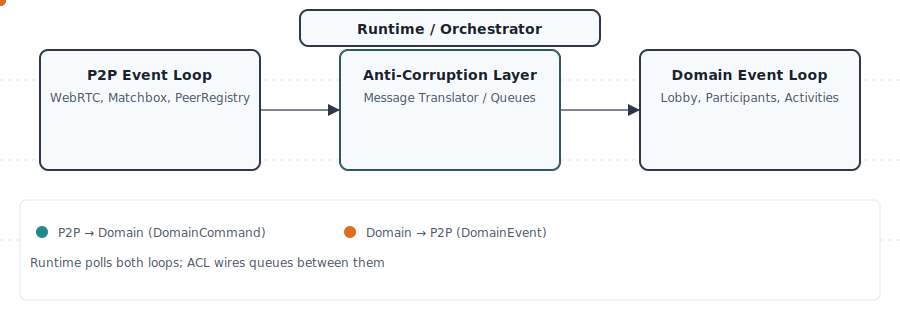

= Step 4: Strategize – Core Domain Charts
:icons: font
:toc: left
:toclevels: 3
:sectnums:

== Purpose

Identify which subdomains are **core** (strategic differentiators) vs **supporting** vs **generic**, so we can allocate resources appropriately.

== Core Domain Chart

[plantuml, "core-domain-chart", png]
----
@startuml
!define CORE_COLOR #FF6B6B
!define SUPPORTING_COLOR #4ECDC4
!define GENERIC_COLOR #95E1D3

title Konnekt Session – Core Domain Chart (Revised)

' Axes
!define MAX_COMPLEXITY 100
!define MAX_DIFFERENTIATION 100

rectangle "Business Differentiation ↑" as y_axis
rectangle "Domain Complexity →" as x_axis

' Core Domains (high differentiation, high/medium complexity)
rectangle "Lobby\nManagement" as lobby_mgmt CORE_COLOR
rectangle "Activity\nLifecycle" as activity_lifecycle CORE_COLOR
rectangle "Host/Guest\nManagement" as role_mgmt CORE_COLOR

' Supporting Domains (medium differentiation, medium complexity)
rectangle "Activity\nCatalog &\nPlugins" as activity_catalog SUPPORTING_COLOR
rectangle "Participation\nMode\n(Spectator)" as participation_mode SUPPORTING_COLOR
rectangle "Authentication\n& Identity" as auth SUPPORTING_COLOR
rectangle "Game State\nSerialization" as game_state SUPPORTING_COLOR

' Generic Domains (low differentiation, low/medium complexity)
rectangle "P2P State Sync\n(Round-Robin)" as p2p_sync GENERIC_COLOR
rectangle "WebRTC\nSignalling" as webrtc GENERIC_COLOR
rectangle "Message\nSerialization" as serialization GENERIC_COLOR
rectangle "Local Storage" as storage GENERIC_COLOR

' Positioning
lobby_mgmt -[hidden]-> activity_lifecycle
activity_lifecycle -[hidden]-> role_mgmt
role_mgmt -[hidden]-> activity_catalog
activity_catalog -[hidden]-> participation_mode
participation_mode -[hidden]-> auth
auth -[hidden]-> game_state
game_state -[hidden]-> p2p_sync
p2p_sync -[hidden]-> webrtc
webrtc -[hidden]-> serialization
serialization -[hidden]-> storage

note right of lobby_mgmt
**Core Domain**
This is what users pay for:
• Creating & managing game sessions
• Host/Guest model with delegation
• Managing lobby lifecycle
• Inviting/kicking guests
High differentiation & complexity
end note

note right of participation_mode
**Supporting Domain**
Enables flexible participation:
• Active vs Spectating modes
• Toggle between modes
• Not highly differentiating
(many systems have "observer mode")
end note

note right of p2p_sync
**Generic Subdomain**
Round-robin consensus is well-known
Use existing patterns (Raft-like, CRDT)
Low differentiation: infrastructure concern
Can use library or standard algorithm
end note

@enduml
----

== Domain Classification (Revised)

[cols="2,1,1,3", options="header"]
|===
|Subdomain
|Type
|Investment Level
|Rationale

|**Lobby Management**
|Core
|⭐⭐⭐⭐⭐
a|
* **Primary business value** – what developers integrate for
* Managing session lifecycle (create, join, leave, close)
* Guest admission control (passwords, invites, kicks)
* Lobby configuration (max guests, privacy settings)
* This is what makes the product unique & valuable

|**Activity Lifecycle**
|Core
|⭐⭐⭐⭐⭐
a|
* **Core user workflow** – starting/stopping games
* Activity state machine (planned → in-progress → finished)
* Results collection from active guests
* Activity ordering & queue management
* Critical to user experience

|**Host/Guest Management**
|Core
|⭐⭐⭐⭐⭐
a|
* **Domain-specific logic** – Host/Guest model
* Host delegation (transferring control)
* Guest permissions & restrictions
* Business rules about who can do what
* Differentiates from generic "player" models

|**Participation Mode (Spectator)**
|Supporting
|⭐⭐⭐
a|
* Enables flexibility (important for UX)
* Active ↔ Spectating mode transitions
* Result submission restrictions
* Moderate complexity (state + validation)
* Not highly differentiating (many systems have observers)

|**Activity Catalog & Plugins**
|Supporting
|⭐⭐⭐
a|
* Enables extensibility (important for adoption)
* Activity registration & discovery
* Plugin versioning & compatibility
* Moderate complexity (trait system)
* Not differentiating (many libs have plugins)

|**Authentication & Identity**
|Supporting
|⭐⭐⭐
a|
* Essential for security, not differentiating
* Key generation & storage (Ed25519)
* Signature verification
* Identity persistence (LocalStorage)
* Use standard crypto libraries

|**Game State Serialization**
|Supporting
|⭐⭐
a|
* Necessary for P2P sync
* Activity-specific data schemas
* Versioning for backwards compatibility
* Use serde + custom codecs if needed

|**P2P State Sync (Round-Robin)**
|Generic
|⭐⭐
a|
* **Infrastructure concern**, not business logic
* Well-known distributed consensus patterns
* Round-robin leader election is textbook CS
* Use existing algorithms (Raft-like, CRDT)
* Low differentiation (commodity)

|**WebRTC Signalling**
|Generic
|⭐
a|
* Solved problem (Matchbox library)
* Zero differentiation
* Use Matchbox as-is

|**Message Serialization**
|Generic
|⭐
a|
* Solved problem (serde, bincode)
* No differentiation

|**Local Storage**
|Generic
|⭐
a|
* Browser API wrapper
* Trivial complexity
|===

== Revised Architecture: Separation of Concerns

=== Layered Architecture

[source]
----
┌─────────────────────────────────────────────────────────┐
│         Core Domain: Lobby Management                    │
│  (Business Logic: Host/Guest, Activities, Permissions)   │
└─────────────────────────────────────────────────────────┘
                          ↓ uses
┌─────────────────────────────────────────────────────────┐
│      Supporting: Participation Mode                      │
│        (Active/Spectating, Mode Transitions)             │
└─────────────────────────────────────────────────────────┘
                          ↓ uses
┌─────────────────────────────────────────────────────────┐
│      Supporting: Authentication & Identity               │
│        (Keys, Signatures, Identity Proofs)               │
└─────────────────────────────────────────────────────────┘
                          ↓ uses
┌─────────────────────────────────────────────────────────┐
│   Generic Infrastructure: P2P State Sync Layer          │
│  (Round-Robin Consensus, Message Ordering, Replication) │
└─────────────────────────────────────────────────────────┘
                          ↓ uses
┌─────────────────────────────────────────────────────────┐
│    Generic Infrastructure: WebRTC Transport              │
│         (Matchbox, Data Channels, Signalling)            │
└─────────────────────────────────────────────────────────┘
----

=== Key Insight

**Host role is domain logic, not sync infrastructure:**

* **Domain Layer**: Host is a `LobbyRole` enum value on a `Participant` entity
  - Business rules: "Only host can start activities"
  - Domain events: `HostDelegated`, `GuestPromotedToHost`
  - Aggregate invariants: "Lobby must have exactly one host"

* **Participation Layer**: Active/Spectating is a separate concern
  - Business rules: "Spectating guests cannot submit results"
  - Domain events: `ParticipationModeChanged`
  - Can change independently of host/guest role

* **Infrastructure Layer**: Round-robin leader election for state sync
  - Technical concern: "Who broadcasts the next state update?"
  - Could be ANY peer (not necessarily the domain host)
  - Could rotate every N seconds or every M messages
  - Completely decoupled from domain concept of "host"

=== Runtime & Integration Pattern

To keep the domain pure (hexagonal/DDD) while supporting P2P networking, we adopt a
dual-event-loop pattern connected by an Anti-Corruption Layer (ACL). This keeps
responsibilities separated:

* P2P Event Loop (in konnekt-session-p2p): handles WebRTC/Matchbox, peer registry,
  heartbeats and raw P2P messages.
* Domain (Core) Event Loop (in konnekt-session-core): consumes DomainCommands,
  runs lobby/domain logic, and emits DomainEvents.
* ACL / Message Translator (application layer): translates P2P messages ↔ Domain
  commands/events and wires queues between the two loops.

Benefits: clear bounded context boundaries, independent testing and evolution,
and minimal coupling between infrastructure and domain.

[plantuml, "dual-event-loop-brief", png]
----
@startuml
title Dual Event Loop (brief)

actor "Runtime / Orchestrator" as Orch

rectangle "P2P Bounded Context\n(konnekt-session-p2p)" as P2P {
  component "P2P Event Loop\n(WebRTC, peer registry)" as P2PLoop
  queue "P2P → ACL queue" as Qp
  queue "ACL → P2P queue" as Qp2
}

rectangle "Anti-Corruption Layer\n(Application glue)" as ACL {
  component "Translator / Queues" as T
}

rectangle "Domain Bounded Context\n(konnekt-session-core)" as Domain {
  component "Domain Event Loop\n(Lobby, Participants, Activities)" as DLoop
  queue "ACL → Domain queue" as Qd
  queue "Domain → ACL queue" as Qd2
}

Orch --> P2PLoop : poll()
Orch --> DLoop : poll()

P2PLoop -> Qp : P2PMessage
Qp -> T : translate()
T -> Qd : DomainCommand

DLoop -> Qd2 : DomainEvent
Qd2 -> T : translate()
T -> Qp2 : P2PMessage

P2PLoop <- Qp2 : send()
DLoop <- Qd : handle()

@enduml
----

A compact animated illustration is included below to make the flow obvious at-a-glance:

Implementation notes (short)
* P2P crate exposes an event-loop type that accepts outbound P2P messages (from ACL) and produces inbound raw messages (to ACL).
* Core crate exposes a domain-loop type that accepts DomainCommands and emits DomainEvents.
* The application (orchestrator / CLI) composes the ACL/translator with bounded channels (tokio::mpsc or wasm-compatible channels) to wire the two loops.
* Tests: unit-test domain loop with mock command queue; unit-test P2P loop with mock messages; integration tests verify ACL translations.

See xref:adr/0020-use-dual-event-loop-with-acl.adoc[ADR-0020] for the rationale and extended diagrams.

=== Example Scenario

[source]
----
Lobby has 4 participants:
  - Alice (Host, Active mode)
  - Bob (Guest, Active mode)
  - Carol (Guest, Active mode)
  - Dave (Guest, Spectating mode)

P2P Sync uses round-robin:
  - Cycle 1: Alice broadcasts
  - Cycle 2: Bob broadcasts
  - Cycle 3: Carol broadcasts
  - Cycle 4: Dave broadcasts
  - Cycle 5: Alice broadcasts again
  (All peers participate in sync, regardless of participation mode)

Alice (domain host) can:
  - Kick guests (domain logic)
  - Start activities (domain logic)
  - Toggle her own participation mode (Active ↔ Spectating)

Bob/Carol (guests, active) can:
  - Submit activity results (allowed when Active)
  - Toggle to Spectating mode (self-controlled)
  - Their P2P broadcasts replicate Alice's commands

Dave (guest, spectating) can:
  - Watch activities (read-only)
  - Toggle to Active mode (to participate)
  - Still participates in P2P sync broadcasts

All guests cannot:
  - Execute host commands (domain forbids it)
  - Kick other guests
  - Start/stop activities
----

== Complexity Assessment (Revised)

[cols="2,1,4", options="header"]
|===
|Subdomain
|Complexity Score (1-10)
|Complexity Drivers

|**Lobby Management**
|8
a|
* Complex state machine (lobby states)
* Multi-actor concurrency (simultaneous joins)
* Invariant enforcement (max guests, unique names)
* Password protection & invite codes
* Lobby closure & cleanup logic
* Edge cases: host leaves, last guest leaves

|**Activity Lifecycle**
|7
a|
* Activity state transitions (planned → running → done)
* Result collection from active guests only
* Timeout handling (max activity duration)
* Activity cancellation & restart logic
* Scoring & leaderboard calculations (excluding spectators)
* Edge cases: activity running when host disconnects

|**Host/Guest Management**
|7
a|
* Host delegation rules (when, to whom)
* Auto-promotion when host disconnects (30s timeout)
* Deterministic election (oldest guest by timestamp)
* Permission enforcement (who can do what)
* Guest kick logic & notifications
* Reconnection handling (grace period vs permanent loss)
* Edge cases: all guests leave, identical timestamps, single guest

|**Participation Mode (Spectator)**
|5
a|
* Mode transition rules (Active ↔ Spectating)
* When mode changes are allowed (not during activity)
* Result submission validation (only Active guests)
* Forced mode changes by host (optional)
* Activity completion logic (only count Active guests)

|**Activity Catalog & Plugins**
|5
a|
* Plugin registration & lifecycle
* Versioning & compatibility checks
* Activity-specific data schemas
* Hot-reload considerations

|**Authentication & Identity**
|4
a|
* Key generation (Ed25519)
* Signature verification
* Key persistence & recovery
* Clock skew handling (timestamp verification)

|**Game State Serialization**
|3
a|
* Schema evolution (backwards compatibility)
* Compression for large states
* Partial updates (deltas)

|**P2P State Sync (Round-Robin)**
|4
a|
* **Well-studied problem** (use existing algorithms)
* Leader election (round-robin with timeouts)
* Message ordering (sequence numbers)
* Conflict resolution (last-write-wins)
* Use Raft, CRDT, or simple round-robin

|**WebRTC Signalling**
|2
|Matchbox handles complexity

|**Message Serialization**
|2
|Serde derive macros

|**Local Storage**
|1
|Browser API wrapper
|===

== Differentiation Assessment (Revised)

[cols="2,1,4", options="header"]
|===
|Subdomain
|Differentiation Score (1-10)
|Differentiation Drivers

|**Lobby Management**
|10
a|
* **Primary value proposition** for developers
* Unique UX: seamless lobby flows
* Superior DX: simple API for complex workflows
* Competitive advantage: easier than building from scratch
* This is what developers evaluate when choosing the library

|**Activity Lifecycle**
|9
a|
* **Core user experience** – starting/stopping games
* Unique approach to activity queuing & results
* Differentiation in how activities integrate
* Better than generic "game session" libraries

|**Host/Guest Management**
|9
a|
* **Unique model** (not just "admin" vs "player")
* Host delegation without full reconnect
* Smooth host transitions
* More sophisticated than most lobby libs
* Natural language ("host invites guests")

|**Participation Mode (Spectator)**
|4
a|
* Nice-to-have feature for UX
* Not highly differentiating (many systems have "observer mode")
* Smooth toggling is a plus
* Not a primary decision factor for developers

|**Activity Catalog & Plugins**
|5
a|
* Good plugin system improves DX
* Moderate differentiation (ease of adding games)
* Table stakes for a game library

|**Authentication & Identity**
|3
a|
* Everyone needs auth, not unique
* Slight differentiation in UX (key recovery)

|**Game State Serialization**
|2
|Standard problem, standard solution

|**P2P State Sync (Round-Robin)**
|2
a|
* **Infrastructure, not differentiator**
* Users don't care HOW state syncs, just that it works
* Round-robin is well-known (not novel)
* Could swap for Raft/CRDT without users noticing

|**WebRTC Signalling**
|1
|Commodity (Matchbox)

|**Message Serialization**
|1
|Completely generic

|**Local Storage**
|1
|Browser standard
|===

== Investment Strategy (Revised)

[cols="2,3,3", options="header"]
|===
|Domain Type
|Investment Approach
|Example Actions

|**Core**
(Lobby, Activity Lifecycle, Host/Guest Mgmt)
a|
* **Build in-house** with highest quality
* Deep domain modeling (DDD tactical patterns)
* Extensive testing (domain scenarios)
* Rich documentation & examples
* Continuous UX improvement
* This is where we innovate
a|
* Write domain models (aggregates, entities)
* EventStorming sessions with users
* Property-based testing for invariants
* Tutorial videos & interactive docs
* Blog posts about host/guest patterns

|**Supporting**
(Participation Mode, Activity Catalog, Auth)
a|
* **Build competently** using best practices
* Leverage standard patterns
* Good test coverage
* Clear API documentation
a|
* State machine for mode transitions
* Use Rust trait system for plugins
* Standard crypto libraries (ring, ed25519-dalek)
* API reference docs

|**Generic**
(P2P Sync, WebRTC, Storage)
a|
* **Buy, use libraries, or use textbook algorithms**
* Minimal custom code
* Thin wrappers only if needed
* Outsource to community/libraries
a|
* **Use existing round-robin/Raft/CRDT library**
* Use Matchbox for WebRTC
* Use web-sys for LocalStorage
* Copy standard algorithms from papers/books
|===

== Domain Model: Host/Guest + Spectator Mode

=== Rust Implementation

[source,rust]
----
// Domain layer: Host/Guest roles
pub enum LobbyRole {
    Host,   // Can manage lobby, kick guests, start activities
    Guest,  // Regular participant
}

// Participation layer: Active vs Spectating
pub enum ParticipationMode {
    Active,      // Can participate in activities
    Spectating,  // View-only, cannot submit results
}

pub struct Participant {
    id: Uuid,
    name: String,
    lobby_role: LobbyRole,
    participation_mode: ParticipationMode,
}

impl Participant {
    pub fn is_host(&self) -> bool {
        matches!(self.lobby_role, LobbyRole::Host)
    }

    pub fn can_submit_results(&self) -> bool {
        matches!(self.participation_mode, ParticipationMode::Active)
    }

    pub fn can_manage_lobby(&self) -> bool {
        self.is_host()
    }

    pub fn toggle_spectator_mode(&mut self) -> Result<(), DomainError> {
        self.participation_mode = match self.participation_mode {
            ParticipationMode::Active => ParticipationMode::Spectating,
            ParticipationMode::Spectating => ParticipationMode::Active,
        };
        Ok(())
    }
}

// Infrastructure layer: Sync leader (independent)
pub struct SyncLeader {
    current_broadcaster: PeerId,
    rotation_schedule: Vec<PeerId>,
}

// These are INDEPENDENT:
// - Domain host (LobbyRole::Host) manages lobby
// - Participation mode (Active/Spectating) controls activity submission
// - Sync leader (infrastructure) controls state broadcast rotation
----

=== Business Rules

[source,rust]
----
impl Lobby {
    pub fn submit_result(&mut self, participant_id: Uuid, result: ActivityResult)
        -> Result<(), DomainError> {

        let participant = self.find_participant(participant_id)?;

        // Check participation mode
        if !participant.can_submit_results() {
            return Err(DomainError::SpectatorCannotSubmit);
        }

        // Check activity state
        let activity = self.current_activity()?;
        if activity.status != ActivityStatus::InProgress {
            return Err(DomainError::ActivityNotRunning);
        }

        // Submit result
        activity.add_result(participant_id, result)?;

        // Check if all ACTIVE participants have submitted
        if self.all_active_participants_submitted() {
            activity.complete()?;
        }

        Ok(())
    }

    fn all_active_participants_submitted(&self) -> bool {
        let active_participants = self.participants.iter()
            .filter(|p| matches!(p.participation_mode, ParticipationMode::Active))
            .count();

        let submitted_count = self.current_activity()
            .map(|a| a.results.len())
            .unwrap_or(0);

        active_participants == submitted_count
    }
}
----

=== Benefits of Separation

1. **Clear domain model** – Host/Guest is about authority, Active/Spectating is about participation
2. **Flexible UX** – Host can spectate, guests can toggle modes
3. **Testable in isolation** – Test lobby rules without P2P, test participation without host logic
4. **Swappable sync layer** – Can upgrade sync without touching domain code
5. **Natural language** – "Host invites guests" is intuitive

== Alternative Sync Approaches (Future)

Since sync is **generic**, we have options:

[cols="2,3,3,2", options="header"]
|===
|Approach
|Pros
|Cons
|When to Use

|**Round-Robin**
a|
* Simple to implement
* Fair distribution of broadcast load
* Predictable
a|
* Single point of failure (current leader)
* Latency (wait for your turn)
|v1.0 (simple)

|**Host-Only Broadcast**
a|
* Clear authority (domain host = sync leader)
* Lowest latency (no rotation)
a|
* Host is bottleneck
* Host disconnect breaks sync
|v1.0 alternative

|**CRDT (Conflict-Free)**
a|
* No leader needed
* High availability
a|
* Complexity
* Larger message sizes
|v2.0 (research)

|**Raft Consensus**
a|
* Battle-tested
* Leader election built-in
a|
* Heavyweight for browser
* Overkill for game lobbies
|Future (if needed)
|===

== Risk Analysis (Revised)

[cols="2,3,2,2", options="header"]
|===
|Subdomain
|Risk
|Mitigation
|Priority

|**Lobby Management**
|Complex state machine bugs (edge cases)
|Property-based testing, formal state machine modeling
|🔴 Critical

|**Activity Lifecycle**
|Race conditions (simultaneous activity starts)
|Domain invariants, command validation
|🔴 Critical

|**Host/Guest Management**
|Orphaned lobby (host leaves, no guests)
|Auto-close lobby after timeout
|🟡 Medium

|**Participation Mode**
|Mode change during activity (gaming the system)
|Forbid mode changes during active activity
|🟡 Medium

|**P2P Sync**
|Sync leader disconnect
|Timeout + re-election (standard algorithm)
|🟡 Medium

|**Authentication**
|Key loss (user can't rejoin as original identity)
|Key export/backup UX
|🟡 Medium
|===

== Next Steps

1. **Focus 80% effort on Core Domains**:
   - Deep domain modeling for Lobby Management
   - Host delegation state machine design
   - Activity lifecycle with spectator handling
   - Guest permissions & restrictions

2. **Use off-the-shelf for Generic**:
   - Research existing Rust CRDT/Raft libraries
   - Implement simple round-robin as v1.0 sync
   - Document sync layer as swappable component

3. **Validate with users**:
   - EventStorm host/guest workflows
   - Prototype spectator mode UX
   - Test host delegation scenarios
   - Collect feedback on terminology

4. Move to **Step 3: Decompose** to identify subdomain boundaries
