= Step 5: Connect – Domain Message Flows
:icons: font
:toc: left
:toclevels: 3
:sectnums:

== Purpose

Connect the subdomains into a loosely-coupled architecture by modeling end-to-end message flows. This validates that our subdomain boundaries support actual business use cases and uncovers hidden coupling or complexity.

== Core Business Flows

=== Flow 1: Create Lobby & First Guest Joins

[plantuml, "flow-create-and-join", png]
----
@startuml
!include https://raw.githubusercontent.com/plantuml-stdlib/C4-PlantUML/master/C4_Sequence.puml
@startuml
title Domain Message Flow: Create Lobby & First Join

actor "Host User" as host_user
actor "Guest User" as guest_user

box "Host's Browser"
participant "Yew UI" as host_ui
participant "Lobby Domain" as host_domain
participant "Auth Service" as host_auth
participant "P2P Sync" as host_p2p
end box

box "Guest's Browser"
participant "Yew UI" as guest_ui
participant "Lobby Domain" as guest_domain
participant "Auth Service" as guest_auth
participant "P2P Sync" as guest_p2p
end box

participant "Matchbox\nSignalling" as matchbox

== Host Creates Lobby ==

host_user -> host_ui : 1. Click "Create Lobby"
activate host_ui

host_ui -> host_domain : 2. CreateLobby(name, password?)
activate host_domain

host_domain -> host_domain : 3. Generate lobby ID
host_domain -> host_domain : 4. Create Host participant
host_domain --> host_ui : 5. LobbyCreated(lobby_id)
deactivate host_domain

host_ui -> host_auth : 6. Generate Ed25519 keypair
activate host_auth
host_auth --> host_ui : 7. PrivateKey, PublicKey
deactivate host_auth

host_ui -> matchbox : 8. Connect to room(lobby_id)
activate matchbox
matchbox --> host_ui : 9. WebRTC channel ready
deactivate matchbox

host_ui --> host_user : 10. Display lobby (waiting for guests)
deactivate host_ui

== Guest Discovers Lobby ==

guest_user -> guest_ui : 11. Enter lobby_id
activate guest_ui

guest_ui -> guest_auth : 12. Generate keypair
activate guest_auth
guest_auth --> guest_ui : 13. Keys ready
deactivate guest_auth

guest_ui -> matchbox : 14. Connect to room(lobby_id)
activate matchbox
matchbox -> host_p2p : 15. New peer connected
matchbox -> guest_p2p : 16. Peer discovery
matchbox --> guest_ui : 17. WebRTC channels established
deactivate matchbox

== P2P Handshake ==

guest_ui -> guest_domain : 18. JoinLobby(name, password?)
activate guest_domain

guest_domain -> guest_p2p : 19. Sign & send JoinRequest
activate guest_p2p

guest_p2p -> host_p2p : 20. P2P: JoinRequest(guest_id, signature)
activate host_p2p

host_p2p -> host_domain : 21. Verify & process JoinRequest
activate host_domain

host_domain -> host_domain : 22. Validate password
host_domain -> host_domain : 23. Add Guest participant (Active mode)
host_domain --> host_p2p : 24. GuestJoined(guest_id)
deactivate host_domain

host_p2p -> guest_p2p : 25. P2P: LobbyState(participants, activities)
deactivate host_p2p

guest_p2p -> guest_domain : 26. Apply LobbyState
deactivate guest_p2p

guest_domain --> guest_ui : 27. Lobby synced
deactivate guest_domain

guest_ui --> guest_user : 28. Display lobby (as guest)
deactivate guest_ui

host_p2p -> host_ui : 29. GuestJoined event
host_ui --> host_user : 30. Show "Bob joined"

@enduml
----

==== Message Definitions

[cols="2,3,2,3", options="header"]
|===
|Message
|Direction
|Subdomain
|Payload

|**CreateLobby**
|UI → Domain
|Lobby Management
a|
[source,rust]
----
struct CreateLobby {
    name: String,
    password: Option<String>,
    max_guests: usize,
}
----

|**LobbyCreated**
|Domain → UI
|Lobby Management
a|
[source,rust]
----
struct LobbyCreated {
    lobby_id: Uuid,
    host_id: Uuid,
    created_at: Timestamp,
}
----

|**JoinRequest**
|Guest → Host (P2P)
|Participant Management
a|
[source,rust]
----
struct JoinRequest {
    guest_id: PublicKey,
    name: String,
    password: Option<String>,
    signature: Signature,
    timestamp: Timestamp,
}
----

|**GuestJoined**
|Host → All (P2P Broadcast)
|Participant Management
a|
[source,rust]
----
struct GuestJoined {
    guest_id: Uuid,
    name: String,
    participation_mode: ParticipationMode, // Active
    joined_at: Timestamp,
}
----

|**LobbyState**
|Host → Guest (P2P)
|P2P State Sync
a|
[source,rust]
----
struct LobbyState {
    lobby_id: Uuid,
    participants: Vec<Participant>,
    activities: Vec<Activity>,
    sequence: u64,
}
----
|===

'''

=== Flow 2: Start Activity & Collect Results

[plantuml, "flow-activity-lifecycle", png]
----
@startuml
!include https://raw.githubusercontent.com/plantuml-stdlib/C4-PlantUML/master/C4_Sequence.puml

title Domain Message Flow: Activity Lifecycle

Person(host, "Host")
Person(guest1, "Guest 1 (Active)")
Person(guest2, "Guest 2 (Spectating)")

participant "Host UI" as host_ui
participant "Host Activity Mgmt" as host_activity
participant "Host P2P" as host_p2p

participant "Guest1 UI" as g1_ui
participant "Guest1 Activity Mgmt" as g1_activity
participant "Guest1 P2P" as g1_p2p

participant "Guest2 UI" as g2_ui
participant "Guest2 Activity Mgmt" as g2_activity
participant "Guest2 P2P" as g2_p2p

== Host Plans Activity ==

host -> host_ui : 1. Select "Trivia Quiz"
activate host_ui

host_ui -> host_activity : 2. PlanActivity(activity_type)
activate host_activity

host_activity -> host_activity : 3. Generate activity_id
host_activity -> host_activity : 4. Add to queue
host_activity --> host_ui : 5. ActivityPlanned
deactivate host_activity

host_ui -> host_p2p : 6. Broadcast ActivityPlanned
activate host_p2p

host_p2p -> g1_p2p : 7. P2P: ActivityPlanned
host_p2p -> g2_p2p : 8. P2P: ActivityPlanned
deactivate host_p2p

g1_p2p -> g1_activity : 9. Apply ActivityPlanned
g1_activity -> g1_ui : 10. Update queue
g1_ui --> guest1 : 11. Show in queue

g2_p2p -> g2_activity : 12. Apply ActivityPlanned
g2_activity -> g2_ui : 13. Update queue
g2_ui --> guest2 : 14. Show in queue

deactivate host_ui

== Host Starts Activity ==

host -> host_ui : 15. Click "Start"
activate host_ui

host_ui -> host_activity : 16. StartActivity(id)
activate host_activity

host_activity -> host_activity : 17. Check only one running
host_activity -> host_activity : 18. Transition to InProgress
host_activity --> host_ui : 20. ActivityStarted
deactivate host_activity

host_ui -> host_p2p : 21. Broadcast ActivityStarted
activate host_p2p

host_p2p -> g1_p2p : 22. P2P: ActivityStarted
host_p2p -> g2_p2p : 23. P2P: ActivityStarted
deactivate host_p2p

g1_p2p -> g1_activity : 24. Apply ActivityStarted
g1_activity -> g1_ui : 25. Launch activity UI
g1_ui --> guest1 : 26. Play quiz

g2_p2p -> g2_activity : 27. Apply ActivityStarted
g2_activity -> g2_ui : 28. Launch activity UI (read-only)
g2_ui --> guest2 : 29. Watch quiz

deactivate host_ui

== Guests Submit Results ==

guest1 -> g1_ui : 30. Complete quiz (score: 8)
activate g1_ui

g1_ui -> g1_activity : 31. SubmitResult(score, time)
activate g1_activity

g1_activity -> g1_activity : 32. Check mode == Active
g1_activity --> g1_ui : 34. ResultSubmitted
deactivate g1_activity

g1_ui -> g1_p2p : 35. Broadcast ResultSubmitted
activate g1_p2p

g1_p2p -> host_p2p : 36. P2P: ResultSubmitted
g1_p2p -> g2_p2p : 37. P2P: ResultSubmitted
deactivate g1_p2p

host_p2p -> host_activity : 38. Apply ResultSubmitted
host_activity -> host_ui : 39. Update leaderboard

g2_p2p -> g2_activity : 40. Apply ResultSubmitted
g2_activity -> g2_ui : 41. Update leaderboard

deactivate g1_ui

host -> host_ui : 42. Complete quiz (score: 9)
activate host_ui

host_ui -> host_activity : 43. SubmitResult
activate host_activity

host_activity -> host_activity : 44. All Active submitted?
host_activity -> host_activity : 45. Transition to Completed
host_activity --> host_ui : 46. ActivityCompleted
deactivate host_activity

host_ui -> host_p2p : 47. Broadcast ActivityCompleted
activate host_p2p

host_p2p -> g1_p2p : 48. P2P: ActivityCompleted
host_p2p -> g2_p2p : 49. P2P: ActivityCompleted
deactivate host_p2p

g1_p2p -> g1_activity : 50. Apply ActivityCompleted
g1_activity -> g1_ui : 51. Show leaderboard

g2_p2p -> g2_activity : 52. Apply ActivityCompleted
g2_activity -> g2_ui : 53. Show leaderboard

deactivate host_ui

@enduml
----

==== Message Definitions

[cols="2,3,2,3", options="header"]
|===
|Message
|Direction
|Subdomain
|Payload

|**PlanActivity**
|UI → Domain
|Activity Management
a|
[source,rust]
----
struct PlanActivity {
    activity_type: String,
    config: serde_json::Value,
}
----

|**ActivityPlanned**
|Host → All (P2P)
|Activity Management
a|
[source,rust]
----
struct ActivityPlanned {
    activity_id: Uuid,
    activity_type: String,
    config: serde_json::Value,
    planned_at: Timestamp,
}
----

|**StartActivity**
|UI → Domain
|Activity Management
a|
[source,rust]
----
struct StartActivity {
    activity_id: Uuid,
}
----

|**ActivityStarted**
|Host → All (P2P)
|Activity Management
a|
[source,rust]
----
struct ActivityStarted {
    activity_id: Uuid,
    started_at: Timestamp,
}
----

|**SubmitResult**
|UI → Domain
|Activity Management
a|
[source,rust]
----
struct SubmitResult {
    activity_id: Uuid,
    participant_id: Uuid,
    score: u32,
    time_taken: Duration,
    data: serde_json::Value,
}
----

|**ResultSubmitted**
|Participant → All (P2P)
|Activity Management
a|
[source,rust]
----
struct ResultSubmitted {
    activity_id: Uuid,
    participant_id: Uuid,
    score: u32,
    time_taken: Duration,
    submitted_at: Timestamp,
}
----

|**ActivityCompleted**
|Host → All (P2P)
|Activity Management
a|
[source,rust]
----
struct ActivityCompleted {
    activity_id: Uuid,
    results: Vec<ActivityResult>,
    completed_at: Timestamp,
}
----
|===

'''

=== Flow 3: Host Disconnect & Auto-Delegation

[plantuml, "flow-host-disconnect", png]
----
@startuml
!include https://raw.githubusercontent.com/plantuml-stdlib/C4-PlantUML/master/C4_Sequence.puml

title Host Delegation Protocol (Disconnect)

participant "Host (Alice)" as host
participant "Host P2P" as host_p2p

participant "Guest1 (Bob)" as bob
participant "Bob UI" as bob_ui
participant "Bob Domain" as bob_domain
participant "Bob Participant Mgmt" as bob_participant
participant "Bob Connection Mgmt" as bob_conn
participant "Bob P2P" as bob_p2p

participant "Guest2 (Carol)" as carol
participant "Carol UI" as carol_ui
participant "Carol Domain" as carol_domain
participant "Carol Participant Mgmt" as carol_participant
participant "Carol Connection Mgmt" as carol_conn
participant "Carol P2P" as carol_p2p

== Normal Heartbeat ==

bob_conn -> bob_p2p : 1. Send heartbeat (every 5s)
bob_p2p -> host_p2p : 2. P2P: Heartbeat(bob_id)
host_p2p -> bob_p2p : 3. P2P: HeartbeatAck

carol_conn -> carol_p2p : 4. Send heartbeat
carol_p2p -> host_p2p : 5. P2P: Heartbeat(carol_id)
host_p2p -> carol_p2p : 6. P2P: HeartbeatAck

== Host Disconnects ==

host -> host_p2p : 7. Connection lost
destroy host_p2p

bob_conn -> bob_conn : 8. Heartbeat timeout (10s)
bob_conn -> bob_participant : 9. DisconnectDetected(host_id)
activate bob_participant

carol_conn -> carol_conn : 10. Heartbeat timeout (10s)
carol_conn -> carol_participant : 11. DisconnectDetected(host_id)
activate carol_participant

== Grace Period ==

bob_participant -> bob_participant : 12. Start 30s timer
carol_participant -> carol_participant : 13. Start 30s timer

bob_participant -> bob_participant : 14. Timeout expired
bob_participant -> bob_participant : 15. Am I oldest?

carol_participant -> carol_participant : 16. Timeout expired
carol_participant -> carol_participant : 17. Am I oldest? (No)

deactivate carol_participant

== Bob Claims Host Role ==

bob_participant -> bob_domain : 18. PromoteToHost(self)
activate bob_domain

bob_domain -> bob_domain : 19. Update role
bob_domain --> bob_participant : 20. HostDelegated(bob_id)
deactivate bob_domain

bob_participant -> bob_p2p : 21. Broadcast HostDelegated
deactivate bob_participant
activate bob_p2p

bob_p2p -> carol_p2p : 22. P2P: HostDelegated(bob_id)
deactivate bob_p2p

== Carol Verifies ==

carol_p2p -> carol_participant : 23. Verify claim
activate carol_participant

carol_participant -> carol_participant : 24. Is Bob oldest? (Yes)

carol_participant -> carol_domain : 25. Apply HostDelegated
activate carol_domain

carol_domain -> carol_domain : 26. Update host reference
carol_domain --> carol_participant : 27. State updated
deactivate carol_domain

carol_participant -> carol_ui : 28. Update UI
deactivate carol_participant

carol_ui --> carol : 29. "Bob is now host"

bob_participant -> bob_ui : 30. Update UI
bob_ui --> bob : 31. "You are now host"

== Alice Reconnects ==

host -> bob_p2p : 32. Reconnect (later)
activate host_p2p

bob_p2p -> host_p2p : 33. P2P: CurrentLobbyState

host_p2p -> host_p2p : 34. Apply state

host_p2p -> bob_p2p : 35. P2P: RejoinRequest

bob_p2p -> bob_domain : 36. GuestRejoined(alice_id)
bob_domain -> bob_p2p : 37. Broadcast

bob_p2p -> host_p2p : 38. P2P: GuestRejoined
bob_p2p -> carol_p2p : 39. P2P: GuestRejoined

deactivate host_p2p

@enduml
----

==== Message Definitions

[cols="2,3,2,3", options="header"]
|===
|Message
|Direction
|Subdomain
|Payload

|**Heartbeat**
|All → All (P2P)
|Connection Management
a|
[source,rust]
----
struct Heartbeat {
    participant_id: Uuid,
    timestamp: Timestamp,
}
----

|**HeartbeatAck**
|Receiver → Sender (P2P)
|Connection Management
a|
[source,rust]
----
struct HeartbeatAck {
    participant_id: Uuid,
    timestamp: Timestamp,
}
----

|**DisconnectDetected**
|Internal Event
|Connection Management
a|
[source,rust]
----
struct DisconnectDetected {
    participant_id: Uuid,
    detected_at: Timestamp,
}
----

|**HostDelegated**
|New Host → All (P2P)
|Participant Management
a|
[source,rust]
----
struct HostDelegated {
    new_host_id: Uuid,
    old_host_id: Uuid,
    reason: DelegationReason,
    timestamp: Timestamp,
}

enum DelegationReason {
    Timeout,       // Auto-delegation
    Manual,        // Host chose to delegate
    Disconnect,    // Host left permanently
}
----

|**RejoinRequest**
|Reconnecting Guest → Host (P2P)
|Participant Management
a|
[source,rust]
----
struct RejoinRequest {
    participant_id: Uuid,
    original_role: LobbyRole, // What I was before
    signature: Signature,
}
----

|**GuestRejoined**
|Host → All (P2P)
|Participant Management
a|
[source,rust]
----
struct GuestRejoined {
    guest_id: Uuid,
    rejoined_at: Timestamp,
}
----
|===

'''

=== Flow 4: Guest Toggles Spectator Mode

[plantuml, "flow-spectator-toggle", png]
----
!include https://raw.githubusercontent.com/plantuml-stdlib/C4-PlantUML/master/C4_Sequence.puml

title Toggle Spectator Mode

participant "Guest (Carol)" as guest
participant "Carol UI" as carol_ui
participant "Carol Participant Mgmt" as carol_participant
participant "Carol Activity Mgmt" as carol_activity
participant "Carol P2P" as carol_p2p

participant "Host" as host
participant "Host UI" as host_ui
participant "Host Participant Mgmt" as host_participant
participant "Host P2P" as host_p2p

participant "Other Guest UI" as other_ui
participant "Other Participant Mgmt" as other_participant
participant "Other P2P" as other_p2p

== Scenario 1: Toggle Before Activity ==

guest -> carol_ui : 1. Click "Switch to Spectating"
activate carol_ui

carol_ui -> carol_participant : 2. ToggleSpectatorMode(self)
activate carol_participant

carol_participant -> carol_activity : 3. Is activity running?
carol_activity --> carol_participant : 4. No

carol_participant -> carol_participant : 5. Update mode: Spectating
carol_participant --> carol_ui : 6. ParticipationModeChanged
deactivate carol_participant

carol_ui -> carol_p2p : 7. Broadcast
activate carol_p2p

carol_p2p -> host_p2p : 8. P2P: ParticipationModeChanged
carol_p2p -> other_p2p : 9. P2P: ParticipationModeChanged
deactivate carol_p2p

host_p2p -> host_participant : 10. Apply
host_participant -> host_ui : 11. Update UI
host_ui --> host : 12. "Carol is spectating"

other_p2p -> other_participant : 13. Apply
other_participant -> other_ui : 14. Update UI

deactivate carol_ui

== Scenario 2: During Activity (Rejected) ==

guest -> carol_ui : 15. Click "Switch to Active"
activate carol_ui

carol_ui -> carol_participant : 16. ToggleSpectatorMode
activate carol_participant

carol_participant -> carol_activity : 17. Is activity running?
carol_activity --> carol_participant : 18. Yes, InProgress

carol_participant --> carol_ui : 19. Error: CannotToggle
deactivate carol_participant

carol_ui --> guest : 20. Show error
deactivate carol_ui

== Scenario 3: Host Forces ==

host -> host_ui : 21. "Make Spectator"
activate host_ui

host_ui -> host_participant : 22. ForceSpectatorMode(carol_id)
activate host_participant

host_participant -> host_participant : 23. Update mode
host_participant --> host_ui : 24. ParticipationModeChanged(forced)
deactivate host_participant

host_ui -> host_p2p : 25. Broadcast
activate host_p2p

host_p2p -> carol_p2p : 26. P2P: ParticipationModeChanged(forced)
host_p2p -> other_p2p : 27. P2P: ParticipationModeChanged(forced)
deactivate host_p2p

carol_p2p -> carol_participant : 28. Apply
carol_participant -> carol_ui : 29. Update mode
carol_ui --> guest : 30. "Host changed you to Spectating"

deactivate host_ui

@enduml
----

==== Message Definitions

[cols="2,3,2,3", options="header"]
|===
|Message
|Direction
|Subdomain
|Payload

|**ToggleSpectatorMode**
|UI → Domain
|Participant Management
a|
[source,rust]
----
struct ToggleSpectatorMode {
    participant_id: Uuid,
}
----

|**ForceSpectatorMode**
|UI → Domain (Host only)
|Participant Management
a|
[source,rust]
----
struct ForceSpectatorMode {
    target_id: Uuid,
    mode: ParticipationMode,
}
----

|**ParticipationModeChanged**
|Participant → All (P2P)
|Participant Management
a|
[source,rust]
----
struct ParticipationModeChanged {
    participant_id: Uuid,
    new_mode: ParticipationMode,
    forced: bool, // true if host forced it
    changed_at: Timestamp,
}
----

|**CannotToggleDuringActivity**
|Domain → UI (Error)
|Participant Management
a|
[source,rust]
----
struct CannotToggleDuringActivity {
    activity_id: Uuid,
    participant_id: Uuid,
}
----
|===

'''

== Message Catalog

=== All Domain Messages (Alphabetical)

[cols="2,2,2,4", options="header"]
|===
|Message
|Type
|Subdomain
|Purpose

|**ActivityCompleted**
|Event
|Activity Management
|Activity finished, all active participants submitted

|**ActivityPlanned**
|Event
|Activity Management
|New activity added to queue

|**ActivityStarted**
|Event
|Activity Management
|Activity now in-progress, participants can play

|**CancelActivity**
|Command
|Activity Management
|Host stops activity early

|**CreateLobby**
|Command
|Lobby Management
|User creates new lobby

|**DisconnectDetected**
|Event (Internal)
|Connection Management
|Participant heartbeat timed out (10s)

|**ForceSpectatorMode**
|Command
|Participant Management
|Host changes guest's participation mode

|**GuestJoined**
|Event
|Participant Management
|New guest successfully joined lobby

|**GuestKicked**
|Event
|Participant Management
|Host removed guest from lobby

|**GuestLeft**
|Event
|Participant Management
|Guest voluntarily left lobby

|**GuestRejoined**
|Event
|Participant Management
|Previously disconnected guest returned

|**Heartbeat**
|Event (Infrastructure)
|Connection Management
|Periodic "I'm alive" message (every 5s)

|**HeartbeatAck**
|Event (Infrastructure)
|Connection Management
|Response to heartbeat

|**HostDelegated**
|Event
|Participant Management
|Host role transferred (manual or auto)

|**JoinRequest**
|Command
|Participant Management
|Guest wants to join lobby

|**LobbyCreated**
|Event
|Lobby Management
|New lobby was created

|**LobbyState**
|Snapshot
|P2P State Sync
|Full lobby state for sync

|**ParticipationModeChanged**
|Event
|Participant Management
|Guest toggled Active ↔ Spectating

|**PlanActivity**
|Command
|Activity Management
|Host adds activity to queue

|**RejoinRequest**
|Command
|Participant Management
|Disconnected participant wants to return

|**ResultSubmitted**
|Event
|Activity Management
|Active participant completed activity

|**StartActivity**
|Command
|Activity Management
|Host starts planned activity

|**SubmitResult**
|Command
|Activity Management
|Participant submits their activity result

|**ToggleSpectatorMode**
|Command
|Participant Management
|Guest switches Active ↔ Spectating
|===

'''

== Validation Scenarios

=== Scenario: Activity Completes with Mixed Participation Modes

**Setup:**
- Lobby has 4 participants: Host (Active), Guest1 (Active), Guest2 (Spectating), Guest3 (Active)
- Activity starts (3 active participants: Host, Guest1, Guest3)

**Flow:**
1. Host submits result → `ResultSubmitted` broadcast
2. Guest2 tries to submit → Rejected (Spectating mode)
3. Guest1 submits result → `ResultSubmitted` broadcast
4. Activity still InProgress (waiting for Guest3)
5. Guest3 submits result → `ActivityCompleted` broadcast
6. Leaderboard shows 3 results (Guest2 not included)

**Validation:** ✅ Only active participants counted for completion

'''

=== Scenario: Guest Disconnects Mid-Activity

**Setup:**
- Activity in-progress
- Guest1 (Active) playing activity

**Flow:**
1. Guest1 connection lost
2. After 30s timeout → `GuestLeft` broadcast
3. Activity checks remaining active participants
4. If all other active participants submitted → `ActivityCompleted`
5. Guest1's result marked as "abandoned"

**Validation:** ✅ Activity can complete without disconnected guest

'''

=== Scenario: Host Delegates During Activity

**Setup:**
- Activity in-progress (Host and Guest1 both Active, both playing)

**Flow:**
1. Host chooses to delegate to Guest1
2. `HostDelegated` broadcast
3. Activity continues (no interruption)
4. Old host (now guest) can still submit result
5. New host can still submit result
6. Activity completes when both submit

**Validation:** ✅ Delegation doesn't disrupt activity

'''

=== Scenario: All Guests Switch to Spectating

**Setup:**
- 3 guests, all Active
- No activity running

**Flow:**
1. Guest1 toggles to Spectating → `ParticipationModeChanged`
2. Guest2 toggles to Spectating → `ParticipationModeChanged`
3. Guest3 toggles to Spectating → `ParticipationModeChanged`
4. Host tries to start activity → Warning: "No active participants"
5. Host can still start activity (only host plays)
6. Activity completes when host submits

**Validation:** ✅ Edge case handled gracefully

'''

== Cross-Cutting Concerns

=== Message Signing & Verification

**All P2P messages** are signed and verified:

[source,rust]
----
struct P2PMessage {
    payload: serde_json::Value,
    sender_id: PublicKey,
    signature: Signature,
    timestamp: Timestamp,
    sequence: u64,
}

impl P2PMessage {
    fn verify(&self) -> Result<(), SecurityError> {
        // 1. Verify signature
        self.sender_id.verify(&self.payload, &self.signature)?;

        // 2. Verify timestamp (prevent replay attacks)
        if self.timestamp.age() > Duration::from_secs(60) {
            return Err(SecurityError::StaleMessage);
        }

        // 3. Verify sequence (detect missing messages)
        // ... sequence checking logic ...

        Ok(())
    }
}
----

'''

=== Message Ordering

**Sequence Numbers** ensure message ordering:

[source,rust]
----
struct ParticipantSyncState {
    last_sequence_received: HashMap<PeerId, u64>,
    pending_messages: BTreeMap<u64, P2PMessage>,
}

impl ParticipantSyncState {
    fn apply_message(&mut self, msg: P2PMessage) -> Result<(), SyncError> {
        let expected = self.last_sequence_received
            .get(&msg.sender_id)
            .map(|s| s + 1)
            .unwrap_or(0);

        if msg.sequence == expected {
            // In order - apply immediately
            self.apply(msg)?;
            self.last_sequence_received.insert(msg.sender_id, msg.sequence);

            // Apply any pending messages that are now in order
            self.apply_pending()?;
        } else if msg.sequence > expected {
            // Out of order - queue for later
            self.pending_messages.insert(msg.sequence, msg);
        } else {
            // Duplicate or old message - ignore
        }

        Ok(())
    }
}
----

'''

=== Error Handling

**Message Flow Errors:**

[cols="2,3,3", options="header"]
|===
|Error
|When It Occurs
|Recovery Strategy

|**InvalidSignature**
|Message signature verification fails
|Reject message, log warning, potentially kick sender

|**StaleMessage**
|Message timestamp too old (>60s)
|Reject message (replay attack prevention)

|**OutOfSequence**
|Message sequence gap detected
|Queue message, request missing messages from sender

|**UnknownSender**
|Message from participant not in lobby
|Reject message, close connection

|**StateMismatch**
|Applying message would violate invariant
|Reject message, trigger full state sync
|===

'''

== Next Steps

1. **Implement message serialization** with versioning
2. **Add integration tests** for each flow scenario
3. **Create message replay tool** for debugging
4. **Design state reconciliation protocol** (for out-of-sync clients)
5. **Add observability** (message tracing, sequence diagrams in logs)
