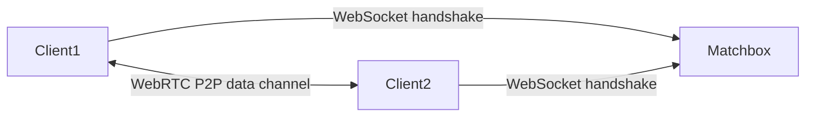

# ADR-0003: Use Matchbox for WebRTC Signaling

**Status**: Accepted | **Date**: 2025-12-29

## Context

P2P connectivity requires WebRTC signaling (SDP exchange, ICE candidates). Core constraint: no central game server.

## Decision

Use **Matchbox** (`matchbox_socket`) for WebRTC signaling.

## Why

- Pure Rust WASM client — zero FFI overhead
- Minimal infrastructure: public server available, self-hostable
- Game-focused API: room-based matching, reliable + unreliable channels
- Stateless signaling server (no game state)
- Actively maintained (Johan Helsing, used in production games)

## Architecture

Matchbox only facilitates the handshake. After that, peers communicate directly.

## Operational Options

- **Dev**: public `wss://matchbox.johanhelsing.studio`
- **Prod**: self-host via Docker (`ghcr.io/johanhelsing/matchbox-server`)
- **NAT issues**: add TURN server

## Trade-offs

- ✅ Zero FFI overhead, minimal ops, type-safe messaging
- ❌ Smaller community, single primary maintainer
- ❌ Signaling server is single point of failure (but peers stay connected after handshake)

## See Also

- [[../concepts/p2p-signing|P2P Signing]]
- [[../architecture/p2p-flow|P2P Message Flow]]
- [[../adr/index|ADR Index]]
