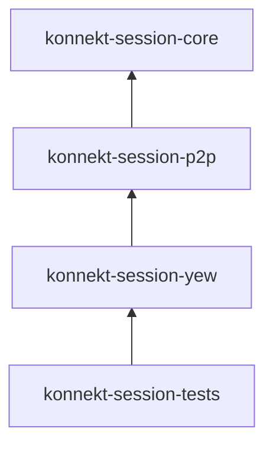

# ADR-0006: Use Cargo Workspace for Modular Architecture

**Status**: Accepted | **Date**: 2025-12-29

## Context

Monolithic crate mixed domain, UI, P2P, and server concerns. Led to tight coupling, long compile times, and no DDD layer enforcement.

## Decision

Use a **Cargo workspace** with focused crates following DDD layers.

## Workspace Structure

```
konnekt-session/
├── crates/
│   ├── konnekt-session-core/   # Domain + Application (pure Rust, zero web deps)
│   ├── konnekt-session-yew/    # Yew UI + WASM glue
│   ├── konnekt-session-p2p/    # P2P infrastructure (Matchbox, WebRTC)
│   └── konnekt-session-tests/  # E2E, BDD, Cucumber tests
```

## Dependency Flow



**Core never depends on infrastructure or UI.**

## Why

- `konnekt-session-core` compiles without WASM — fast unit tests
- Change UI → only rebuild `yew` crate
- Users can depend on individual crates (e.g., core-only)
- `p2p` not named `matchbox` — describes capability, not implementation

## Trade-offs

- ✅ Clear boundaries, faster incremental builds, reusable core
- ❌ More `Cargo.toml` files, version synchronization overhead

## See Also

- [[../architecture/overview|Architecture Overview]]
- [[../adr/index|ADR Index]]
