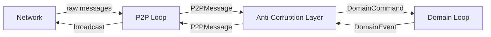

# ADR-0020: Dual Event Loop Architecture with Anti-Corruption Layer

**Status**: Accepted | **Date**: 2025-12-30

## Context

P2P and domain logic were mixed in the main loop, violating DDD bounded context isolation.

## Decision

**Dual event loops** separated by an **Anti-Corruption Layer** (message queues).

## Architecture

- **P2P Loop**: handles connections, signing, WebRTC — knows nothing about `Lobby`
- **Domain Loop**: executes commands, emits events — knows nothing about WebRTC
- **ACL (MessageTranslator)**: translates `P2PMessage ↔ DomainCommand/Event`

## Hexagonal Architecture Mapping

| Hexagonal Term | Component |
|----------------|-----------|
| Adapter (infra) | P2P Loop |
| Core (domain) | Domain Loop |
| Anti-Corruption Layer | MessageTranslator |
| Message bus | mpsc channels |

## Why

- Swap P2P transport (WebRTC → WebTransport) without touching domain
- Test domain with mock command queue — no network needed
- Test P2P with mock domain queue — no business logic needed
- Changes to one loop don't require recompiling the other

## Trade-offs

- ✅ Clean DDD boundaries, independently testable, swappable adapters
- ❌ More complex: two loops, ACL translation code, queue management

## See Also

- [[0021|ADR-0021]] — Mockall mocks the ports this creates
- [[../architecture/overview|Architecture Overview]]
- [[../adr/index|ADR Index]]
