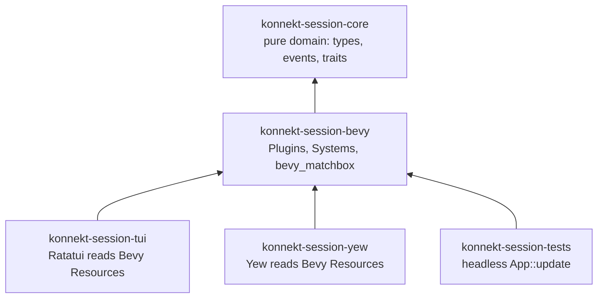
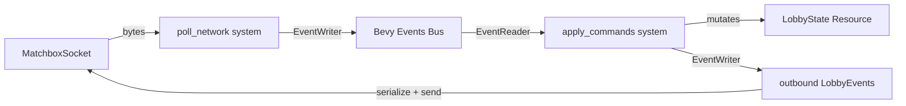
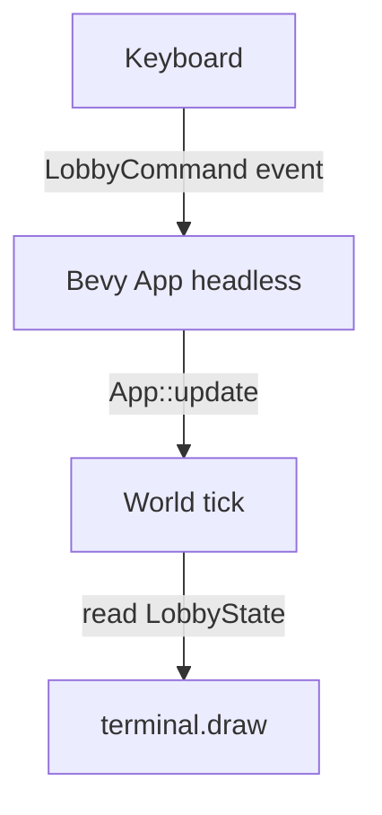

# ADR-0024: Use Bevy ECS as Application Layer

**Status**: Accepted | **Date**: 2026-04-25

## Context

ADR-0020 introduced a dual event loop with a custom Anti-Corruption Layer and mpsc channels to isolate P2P from domain logic. This added deadlock risk, channel backpressure management, and required tokio-console (ADR-0022) just to debug it.

Bevy ECS provides all of this natively: a scheduler, a typed event bus, resources, and systems. `bevy_matchbox` integrates Matchbox as a Bevy Resource, polled via systems.

## Decision

Use **Bevy ECS** (headless) as the application layer in a new `konnekt-session-bevy` crate. `konnekt-session-core` remains pure — no Bevy dependency.

## Crate Boundaries

**Core never gains a Bevy dependency.**

## What Lives Where

### konnekt-session-core (unchanged)

- Domain types: `Lobby`, `Participant`, `Activity`
- Event enum: `LobbyEvent`
- Command enum: `LobbyCommand`
- Port traits: `P2PPort`, `EventCache`
- Value objects, errors, validation

### konnekt-session-bevy (new)

| Bevy Primitive | Role |
|----------------|------|
| `Resource` | `LobbyState` (derived), `MatchboxSocket` |
| `Event` | Newtype wrappers for `LobbyEvent`, `LobbyCommand` |
| `Plugin` | `LobbyPlugin`, `NetworkPlugin` |
| `System` | `poll_network`, `apply_commands`, `broadcast_events` |

## How the Dual Loop Is Replaced

ADR-0020's two loops map directly to Bevy systems in a single `App::update()` tick:

| ADR-0020 Component | Bevy Replacement |
|--------------------|-----------------|
| P2P Loop | `poll_network` system |
| ACL / MessageTranslator | system reading socket → `EventWriter<LobbyEvent>` |
| Domain Loop | `apply_commands` system |
| mpsc channels | `Events<T>` bus |
| Deadlock risk | Eliminated — Bevy scheduler enforces ordering |

## Event Flow

## Headless Usage

Run with `MinimalPlugins` — no window, no renderer. Tick manually:

- **TUI**: `tokio::select!` drives `App::update()` each frame
- **Yew**: `use_animation_frame` drives `App::update()`, App stored in `Rc<RefCell<App>>`
- **Tests**: call `App::update()` directly, assert Resources

## TUI Port

`konnekt-session-tui` replaces its custom dual event loop with a headless Bevy app. Ratatui renders by reading `LobbyState` and `Events<LobbyEvent>` from the Bevy world. Keyboard input writes `LobbyCommand` events into the world.

This is the same pattern as the Yew integration — Ratatui is just another renderer over Bevy state.

## Why Not Bevy for Domain

`konnekt-session-core` must remain framework-free:
- Compiles to native without WASM toolchain
- Cucumber tests run without Bevy runtime
- Future consumers can use core without Bevy

## Trade-offs

| | Dual Loop (ADR-0020) | Bevy ECS |
|-|----------------------|----------|
| Event bus | Custom mpsc channels | `Events<T>` built-in |
| Ordering | Manual, deadlock risk | Scheduler enforces |
| Testability | Timing-sensitive | `App::update()` deterministic |
| Transport swap | Via port traits | Via port traits (same) |
| WASM size | Minimal | ~800KB (Bevy MinimalPlugins) |
| Native TUI | Custom loop | Headless Bevy + Ratatui |

## See Also

- [[0020|ADR-0020]] — superseded: dual event loop
- [[0003|ADR-0003]] — Matchbox (bevy_matchbox replaces matchbox_socket)
- [[0007|ADR-0007]] — Cucumber tests use headless App::update
- [[../rethink/bevy-missing|Rethink: Bevy ECS layer missing]]
- [[../rethink/dual-loop-too-complex|Rethink: Dual loop too complex]]
