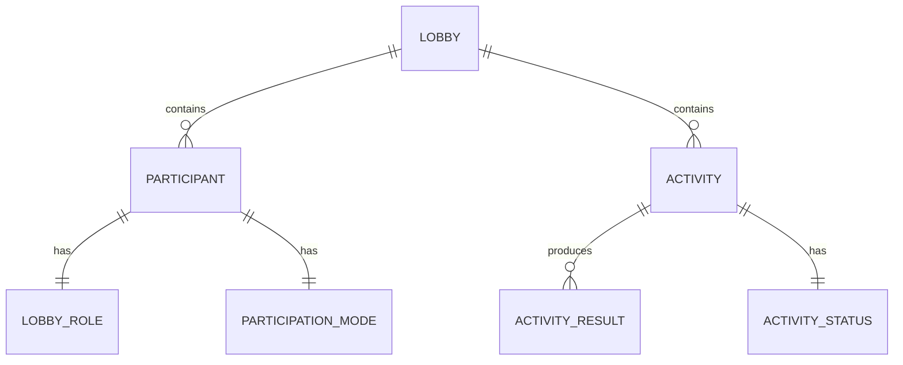

# Domain Model

## Entity Relationships

## Value Objects / Enums

| Type | Values |
|------|--------|
| `LobbyRole` | `Host` \| `Guest` |
| `ParticipationMode` | `Active` \| `Spectating` |
| `ActivityStatus` | `Planned` \| `InProgress` \| `Completed` |

## Key Domain Services

- **LobbyCommandHandler** — processes `JoinLobby`, `StartActivity`, `KickGuest`, `DelegateHost`
- **P2P Sync Service** — broadcasts state updates to peers via Matchbox data channels
- **Auth Service** — signs outgoing messages, verifies incoming, manages Ed25519 keys

## See Also

- [[../domain/lobby|Lobby]]
- [[../domain/participant|Participant]]
- [[../domain/activity|Activity]]
- [[p2p-flow|P2P Message Flow]]
