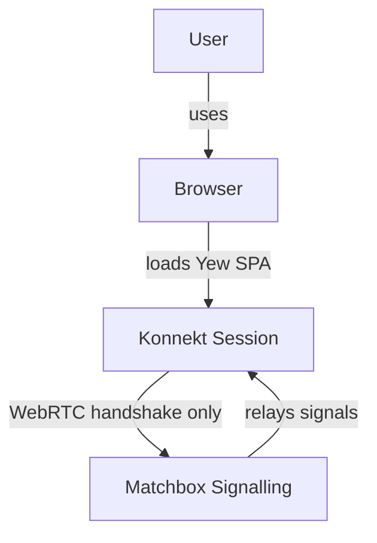
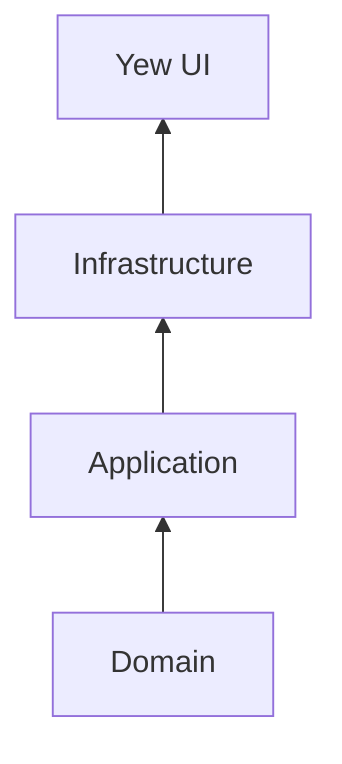

# Architecture Overview

## System Context (C4 Level 1)



Matchbox never sees game state — only the WebRTC handshake.

## Bounded Contexts

| Context | Responsibility |
|---------|----------------|
| **Session Management** | Core domain — `Lobby`, `Participant`, `Activity` |
| **P2P Networking** | WebRTC connections, broadcasting, signature verification |
| **Authentication** | Private keys, identity proofs, host-key handling |
| **Signalling** (external) | Matchbox — WebRTC handshake only |

## Crate Structure

```
konnekt-session-core/     ← published library
├── domain/               ← pure business logic, zero dependencies
├── application/          ← use cases / services
├── infrastructure/       ← P2P, Auth, Storage adapters
└── traits/               ← Activity trait for extensibility

konnekt-session-yew/      ← published UI library
├── components/           ← Lobby, ParticipantList, ActivityQueue
└── hooks/                ← use_lobby, use_p2p
```

## Layered Architecture



Domain has **zero** external dependencies.

## See Also

- [[domain-model|Domain Model]]
- [[p2p-flow|P2P Message Flow]]
- [[../adr/index|ADR Index]]
- `docs/README.adoc` — full C4 diagrams
