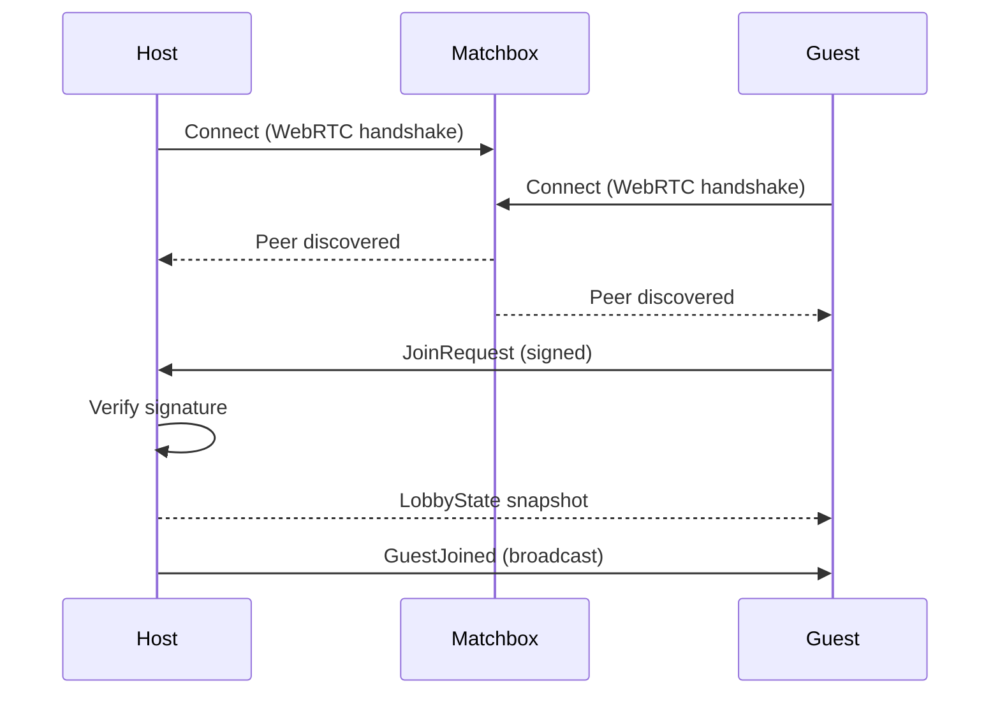
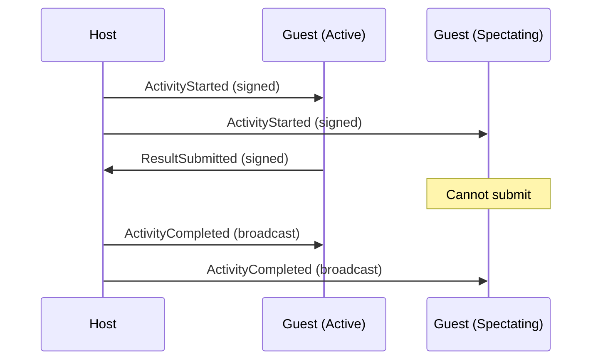
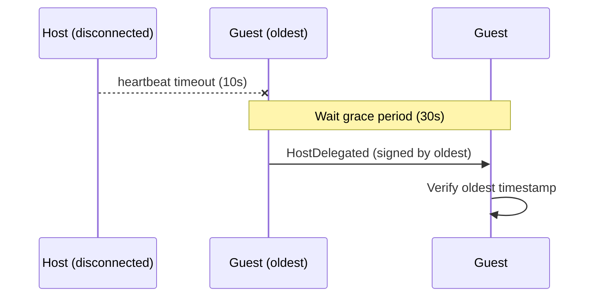

# P2P Message Flow

Every state change follows: **Sign → Broadcast → Verify → Apply**

## Create Lobby & Join

## Start Activity

## Host Delegation

## P2PMessage Envelope

All messages use a signed envelope:
- **payload** — the lobby event
- **signature** — Ed25519 signature of payload
- **sender_id** — public key of sender

## See Also

- [[../concepts/p2p-signing|P2P Signing]]
- [[../concepts/host-delegation|Host Delegation]]
- `konnekt-session-core/src/infrastructure/p2p/`
