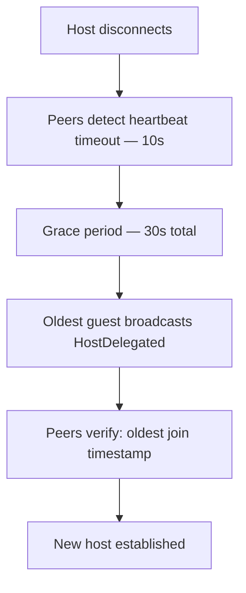

# Host Delegation

Mechanism ensuring the [[../domain/lobby|Lobby]] always has exactly one host.

## Automatic Delegation (Disconnect)



## Manual Delegation

Host can explicitly transfer role to any guest via `DelegateHost` command.

## Host Reclaim

Original host can reclaim role after reconnection by presenting its **stored host key**:

```
Original Host → present host key → verified by peers → role restored
```

## Constraints

- Grace period: **30 seconds** (do not change without consulting the protocol design).
- Election: **oldest guest** by join timestamp wins — deterministic, no voting needed.
- Stored key must match the key used when the lobby was created.

## See Also

- [[../architecture/p2p-flow|P2P Message Flow]] — HostDelegated sequence
- [[../domain/participant|Participant]] — LobbyRole
- `konnekt-session-core/src/infrastructure/auth/`
