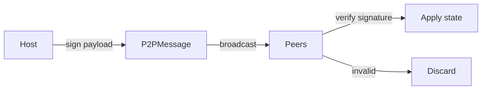

# P2P Signing

All lobby state changes are cryptographically signed with **Ed25519**.

## Key Generation

- Derived client-side from name + password (deterministic).
- Stored in `localStorage` — never leaves the browser.
- Same credentials → same key → enables reconnection and host reclaim.

## Message Flow

## Rules

- Every peer **must** verify the signature before applying any state change.
- Only the **current host's** public key is trusted for authoritative updates.
- Zero-trust: any peer may connect; the signature is the only gatekeeper.

## What NOT to Do

- Never commit private keys.
- Never expose raw WebSocket frames to UI — always wrap in `P2PMessage`.

## ADR

- [[../adr/0004|ADR-0004]]: Client-Side Key Generation for Persistent Identity

## See Also

- [[../architecture/p2p-flow|P2P Message Flow]]
- `konnekt-session-core/src/infrastructure/auth/`
- `konnekt-session-core/src/infrastructure/p2p/`
