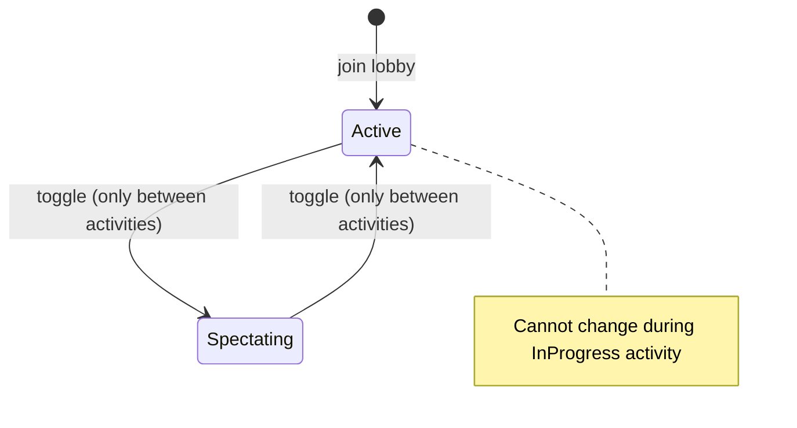

# Participation Modes

Guests can be **Active** or **Spectating**. This is independent of [[lobby-role|Lobby Role]].

## Modes

| Mode | Can Submit Results | Can Watch |
|------|-------------------|-----------|
| `Active` | Yes | Yes |
| `Spectating` | No | Yes |

## Transition Rules



## Interaction with Activity Completion

- Activity completes when **all Active participants** submit results.
- Spectating guests do not block completion.

## Independent from LobbyRole

```
Host   + Active      → can play AND manage
Host   + Spectating  → manages but doesn't play
Guest  + Active      → plays normally
Guest  + Spectating  → watches only
```

## See Also

- [[../domain/participant|Participant]]
- [[../domain/activity|Activity]]
- [[lobby-role|Lobby Role]]
