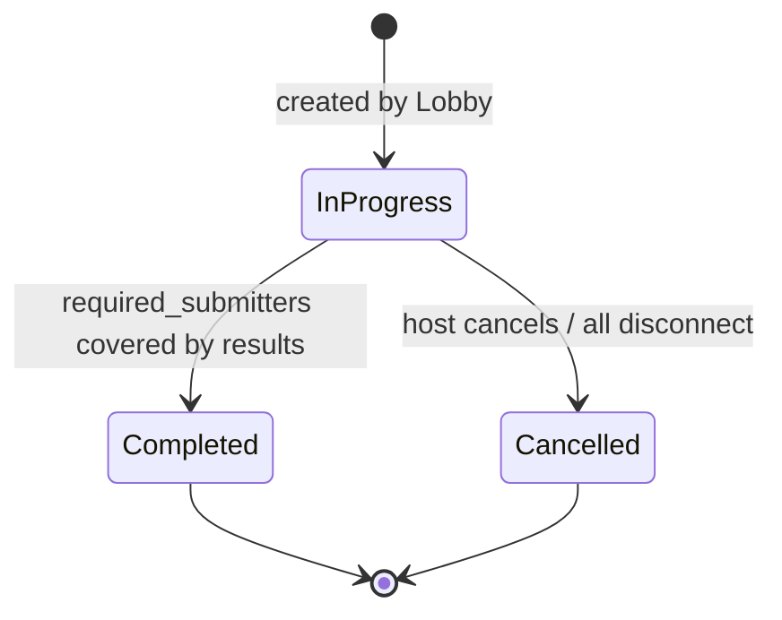

# ActivityRun

Aggregate root for one game in progress. Created by Lobby when host starts the next activity. "Run" — not "session" — to avoid collision with the library name.

## Fields

| Field | Type | Notes |
|-------|------|-------|
| `id` | `ActivityRunId` | — |
| `lobby_id` | `LobbyId` | reference only — no Lobby pointer |
| `config` | `ActivityConfig` | game type and config data |
| `required_submitters` | `Set<ParticipantId>` | snapshot of Active participants at creation |
| `results` | `Map<ParticipantId, ResultData>` | opaque — consuming app owns the type |
| `status` | `RunStatus` | `InProgress \| Completed \| Cancelled` |

## Lifecycle

## Invariants

- `required_submitters` only shrinks — never grows after creation
- Each participant may submit exactly once
- Completes when every member of `required_submitters` has a result

## Commands & Events

| Command | Event |
|---------|-------|
| `SubmitResult(id, data)` | `ResultSubmitted` |
| `RemoveSubmitter(id)` | `SubmitterRemoved` → may trigger `RunCompleted` |
| `CancelRun` | `RunCancelled` |

## Result Data — Opaque

`ResultData` is opaque bytes or `serde_json::Value`. The consuming app owns the concrete type and deserializes after the run completes. Keeps the library generic without Rust generics on the aggregate.

## Snapshot Approach

Active participants are snapshotted at creation time. Subsequent disconnects shrink `required_submitters` via `RemoveSubmitter` — `ActivityRun` never queries live Lobby state.

## See Also

- [[activity|ActivityConfig]] — the value object promoted to start a run
- [[lobby|Lobby]] — owns `active_run_id`
- [[../concepts/participation-modes|Participation Modes]]
- [[../rethink/domain-aggregates|Domain Aggregates — rethink]]
- [[../rethink/activity-disconnect|Activity Disconnect]]
