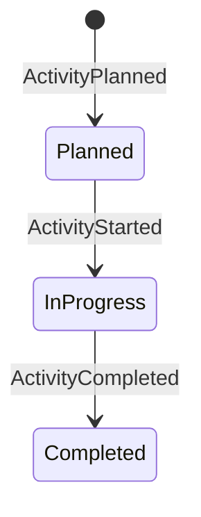

# Activity

A game task provided by the consuming application via the `Activity` trait.

## State Machine



## Fields

| Field | Type | Description |
|-------|------|-------------|
| `id` | UUID | — |
| `status` | `ActivityStatus` | `Planned / InProgress / Completed` |
| `data` | `T: Activity` | Provided by consuming app |

## Results

- Only [[participant|Participants]] with `ParticipationMode::Active` may submit `ActivityResult`.
- Activity completes when all Active participants have submitted.

## Extension Point

Activities are **not** implemented in this library. Consuming apps implement the `Activity` trait:

```rust
// consuming-app/src/activities/trivia.rs
impl Activity for TriviaQuestion { ... }
```

## See Also

- [[../concepts/participation-modes|Participation Modes]]
- [[lobby|Lobby]] — contains the activity queue
