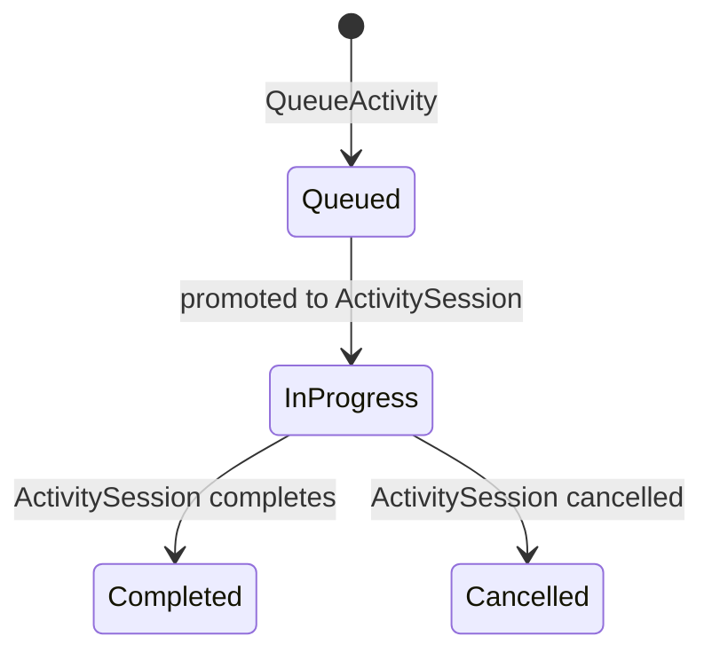
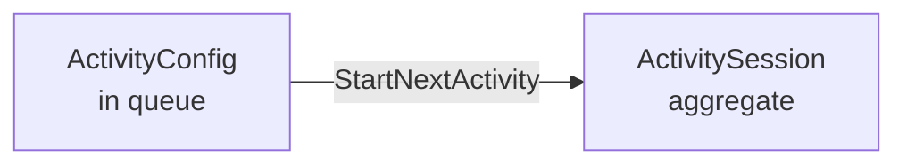

# ActivityConfig

Value object in the Lobby's activity queue. Describes what game to play and how to configure it. Provided entirely by the consuming application.

## Fields

| Field | Type | Notes |
|-------|------|-------|
| `id` | `ActivityId` | stable identity across queue reordering |
| `activity_type` | `String` | discriminator — consuming app interprets |
| `data` | `serde_json::Value` | game-specific config, opaque to library |

## State Machine

`ActivityConfig` itself is immutable — only its status in the queue changes.

## Promotion

When host calls `StartNextActivity`, the front of the queue is promoted:

`ActivityConfig` becomes the `config` field of the new `ActivitySession`.

## Extension Point

The consuming app defines game types and config shapes. The library only needs `activity_type` for routing and `data` for passing through.

## See Also

- [[activity-session|ActivitySession]] — the live aggregate created from this config
- [[lobby|Lobby]] — owns the activity queue
- [[../concepts/participation-modes|Participation Modes]] — determines who plays
