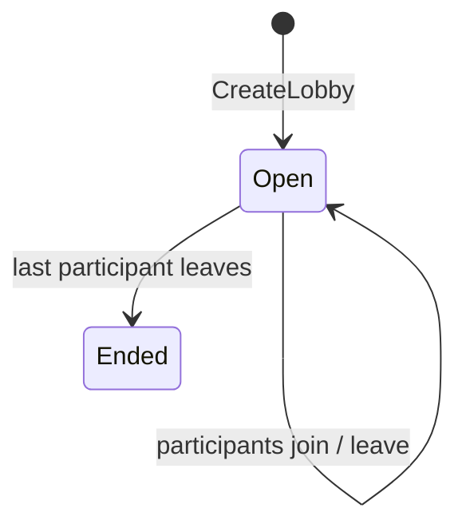
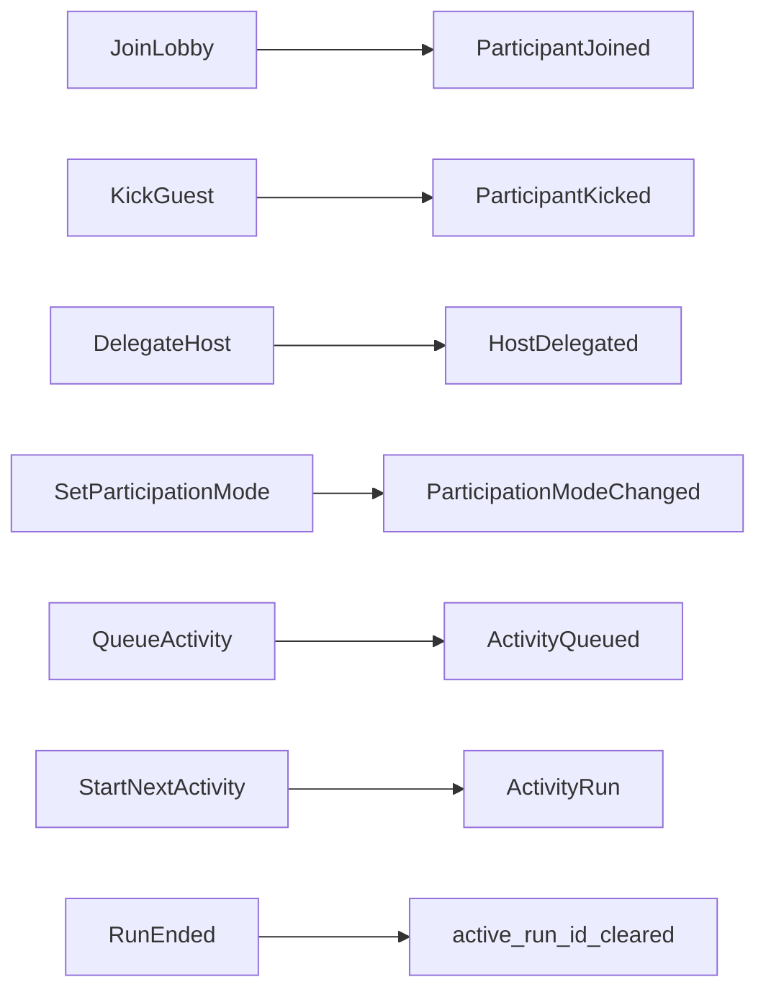

# Lobby

Aggregate root for a session room. Manages membership and tracks the active game.

## Fields

| Field                | Type                              | Notes                          |
| -------------------- | --------------------------------- | ------------------------------ |
| `id`                 | `LobbyId`                         | —                              |
| `participants`       | `Map<ParticipantId, Participant>` | map — uniqueness + O(1) lookup |
| `activity_queue`     | `Queue<ActivityConfig>`           | ordered value objects          |
| `active_run_id` | `Option<ActivityRunId>` | `None` = no game running, `Some` = game in progress |

## Lifecycle

Lobby ends naturally when empty — no explicit close command.

## Invariants

- Exactly one `LobbyRole::Host` at all times
- `active_run_id` is `Some` only while an `ActivityRun` is `InProgress`
- Only the Host may broadcast authoritative state changes

## Commands

## Relations

- Contains [[participant|Participant]] entities (keyed by `ParticipantId`)
- Holds `ActivityConfig` value objects in queue
- References [[activity-run|ActivityRun]] by ID only

## See Also

- [[../concepts/host-delegation|Host Delegation]]
- [[../concepts/lobby-role|Lobby Role]]
- [[../rethink/domain-aggregates|Domain Aggregates — rethink]]
