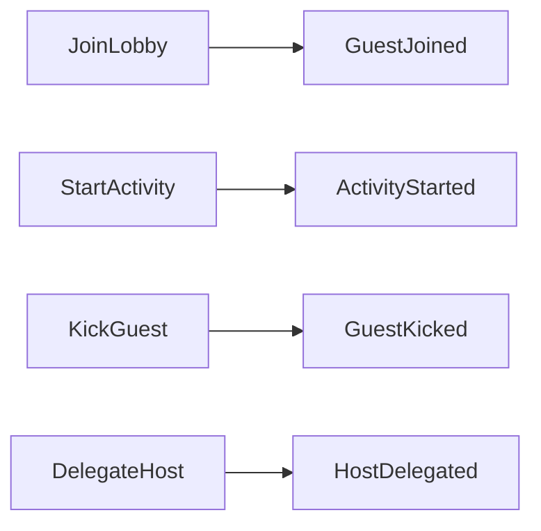

# Lobby

Aggregate root for a single game session.

## Fields

| Field | Type | Description |
|-------|------|-------------|
| `id` | UUID | Unique session identifier |
| `participants` | `Vec<Participant>` | All connected players |
| `activities` | `Vec<Activity>` | Planned/running/completed activities |

## Invariants

- Exactly one participant has `LobbyRole::Host` at all times.
- Only the host may broadcast state-changing events.
- All state changes must carry a valid Ed25519 signature.

## Commands

## Relations

- Contains [[participant|Participant]] entities
- Contains [[activity|Activity]] entities
- Owns the authoritative state replicated via [[../concepts/p2p-signing|P2P Signing]]

## See Also

- [[../concepts/host-delegation|Host Delegation]]
- `docs/02-discover.adoc` — EventStorming results
