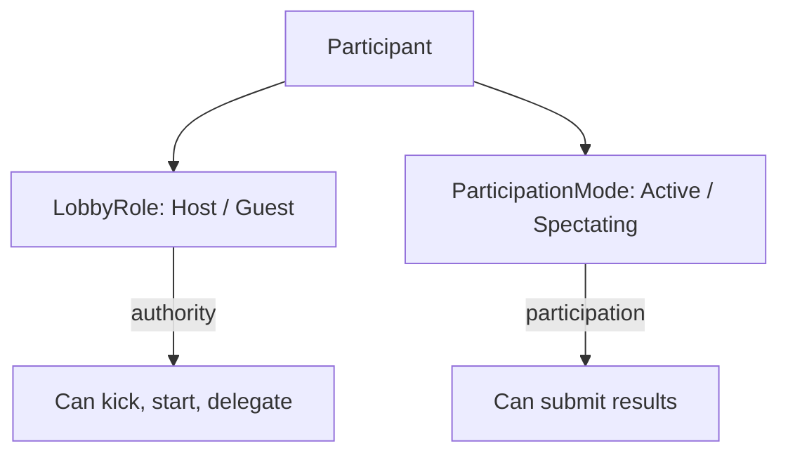

# Participant

Entity representing a connected player in a [[lobby|Lobby]].

## Fields

| Field | Type | Values |
|-------|------|--------|
| `id` | UUID | — |
| `lobby_role` | `LobbyRole` | `Host` \| `Guest` |
| `participation_mode` | `ParticipationMode` | `Active` \| `Spectating` |

## Two Independent Concerns

> A host can be Spectating. A guest can be Active. These are orthogonal.

## Rules

- `LobbyRole::Host` → single; transfers via [[../concepts/host-delegation|Host Delegation]].
- `ParticipationMode` → cannot change during an active activity.
- Only `Active` participants may submit `ActivityResult`.

## See Also

- [[../concepts/participation-modes|Participation Modes]]
- [[../concepts/lobby-role|Lobby Role]]
