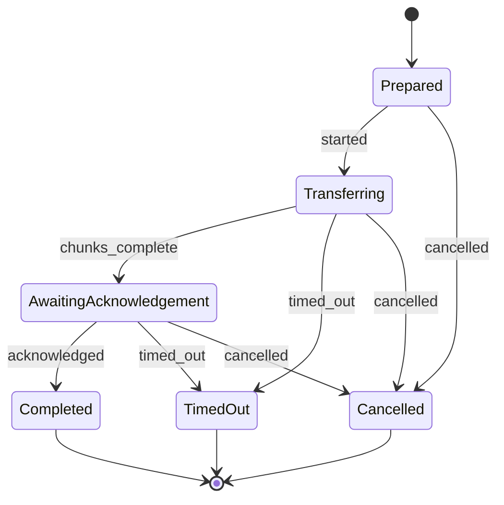

# Asset transfer

```mermaid
stateDiagram-v2
    [*] --> Prepared
    Completed --> [*]
    TimedOut --> [*]
    Cancelled --> [*]
    Prepared --> Transferring : started
    Transferring --> AwaitingAcknowledgement : chunks_complete
    AwaitingAcknowledgement --> Completed : acknowledged
    Transferring --> TimedOut : timed_out
    AwaitingAcknowledgement --> TimedOut : timed_out
    Prepared --> Cancelled : cancelled
    Transferring --> Cancelled : cancelled
    AwaitingAcknowledgement --> Cancelled : cancelled
```
