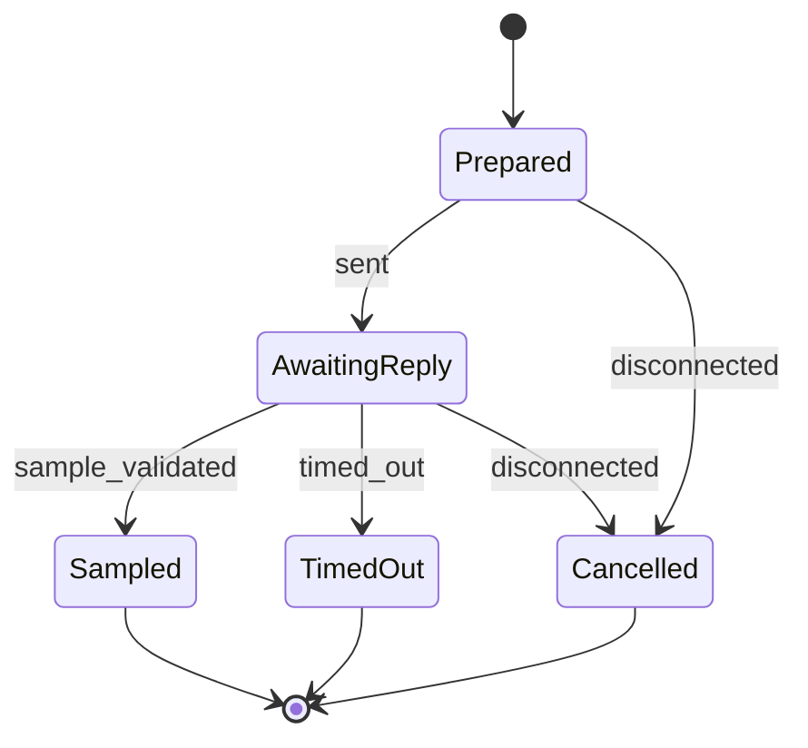

# Clock probe

```mermaid
stateDiagram-v2
    [*] --> Prepared
    Sampled --> [*]
    TimedOut --> [*]
    Cancelled --> [*]
    Prepared --> AwaitingReply : sent
    AwaitingReply --> Sampled : sample_validated
    AwaitingReply --> TimedOut : timed_out
    Prepared --> Cancelled : disconnected
    AwaitingReply --> Cancelled : disconnected
```
