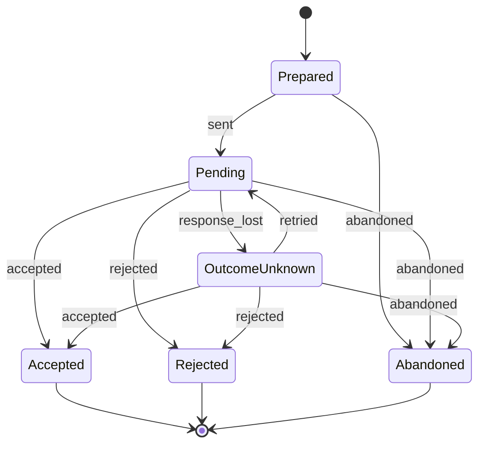

# Command outcome

```mermaid
stateDiagram-v2
    [*] --> Prepared
    Accepted --> [*]
    Rejected --> [*]
    Abandoned --> [*]
    Prepared --> Pending : sent
    Pending --> OutcomeUnknown : response_lost
    OutcomeUnknown --> Pending : retried
    Pending --> Accepted : accepted
    OutcomeUnknown --> Accepted : accepted
    Pending --> Rejected : rejected
    OutcomeUnknown --> Rejected : rejected
    Prepared --> Abandoned : abandoned
    Pending --> Abandoned : abandoned
    OutcomeUnknown --> Abandoned : abandoned
```
