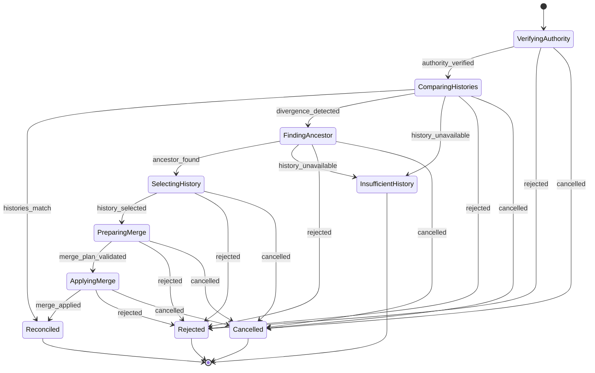

# Event log reconciliation

```mermaid
stateDiagram-v2
    [*] --> VerifyingAuthority
    Reconciled --> [*]
    Rejected --> [*]
    InsufficientHistory --> [*]
    Cancelled --> [*]
    VerifyingAuthority --> ComparingHistories : authority_verified
    ComparingHistories --> Reconciled : histories_match
    ComparingHistories --> FindingAncestor : divergence_detected
    FindingAncestor --> SelectingHistory : ancestor_found
    ComparingHistories --> InsufficientHistory : history_unavailable
    FindingAncestor --> InsufficientHistory : history_unavailable
    SelectingHistory --> PreparingMerge : history_selected
    PreparingMerge --> ApplyingMerge : merge_plan_validated
    ApplyingMerge --> Reconciled : merge_applied
    VerifyingAuthority --> Rejected : rejected
    ComparingHistories --> Rejected : rejected
    FindingAncestor --> Rejected : rejected
    SelectingHistory --> Rejected : rejected
    PreparingMerge --> Rejected : rejected
    ApplyingMerge --> Rejected : rejected
    VerifyingAuthority --> Cancelled : cancelled
    ComparingHistories --> Cancelled : cancelled
    FindingAncestor --> Cancelled : cancelled
    SelectingHistory --> Cancelled : cancelled
    PreparingMerge --> Cancelled : cancelled
    ApplyingMerge --> Cancelled : cancelled
```
