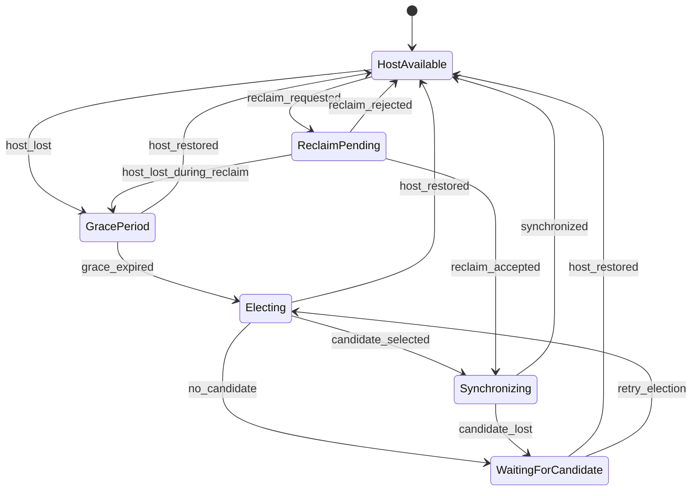

# Host failover

```mermaid
stateDiagram-v2
    [*] --> HostAvailable
    HostAvailable --> GracePeriod : host_lost
    GracePeriod --> HostAvailable : host_restored
    Electing --> HostAvailable : host_restored
    WaitingForCandidate --> HostAvailable : host_restored
    GracePeriod --> Electing : grace_expired
    Electing --> WaitingForCandidate : no_candidate
    WaitingForCandidate --> Electing : retry_election
    Electing --> Synchronizing : candidate_selected
    Synchronizing --> WaitingForCandidate : candidate_lost
    Synchronizing --> HostAvailable : synchronized
    HostAvailable --> ReclaimPending : reclaim_requested
    ReclaimPending --> Synchronizing : reclaim_accepted
    ReclaimPending --> HostAvailable : reclaim_rejected
    ReclaimPending --> GracePeriod : host_lost_during_reclaim
```
