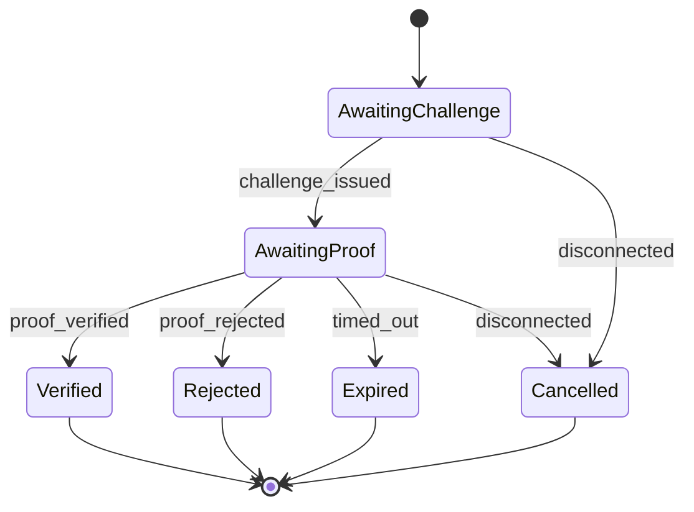

# Identity verification

```mermaid
stateDiagram-v2
    [*] --> AwaitingChallenge
    Verified --> [*]
    Rejected --> [*]
    Expired --> [*]
    Cancelled --> [*]
    AwaitingChallenge --> AwaitingProof : challenge_issued
    AwaitingProof --> Verified : proof_verified
    AwaitingProof --> Rejected : proof_rejected
    AwaitingProof --> Expired : timed_out
    AwaitingChallenge --> Cancelled : disconnected
    AwaitingProof --> Cancelled : disconnected
```
