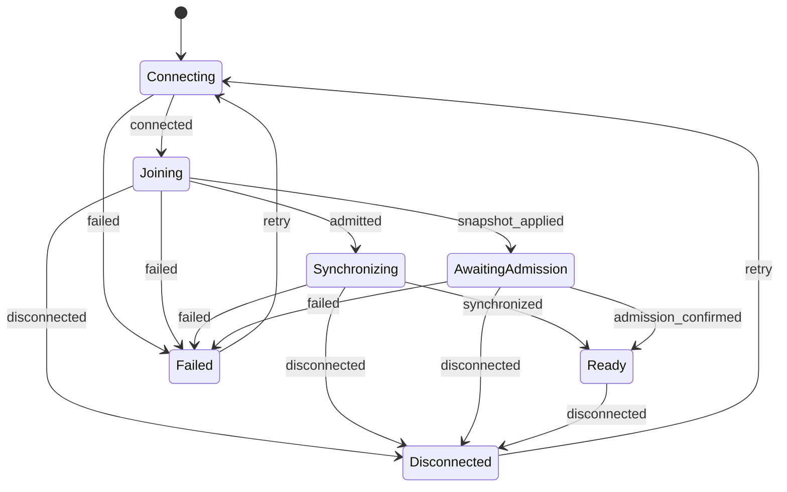

# Join session

```mermaid
stateDiagram-v2
    [*] --> Connecting
    Connecting --> Joining : connected
    Joining --> Synchronizing : admitted
    Joining --> AwaitingAdmission : snapshot_applied
    Synchronizing --> Ready : synchronized
    AwaitingAdmission --> Ready : admission_confirmed
    Connecting --> Failed : failed
    Joining --> Failed : failed
    Synchronizing --> Failed : failed
    AwaitingAdmission --> Failed : failed
    Joining --> Disconnected : disconnected
    Synchronizing --> Disconnected : disconnected
    AwaitingAdmission --> Disconnected : disconnected
    Ready --> Disconnected : disconnected
    Failed --> Connecting : retry
    Disconnected --> Connecting : retry
```
