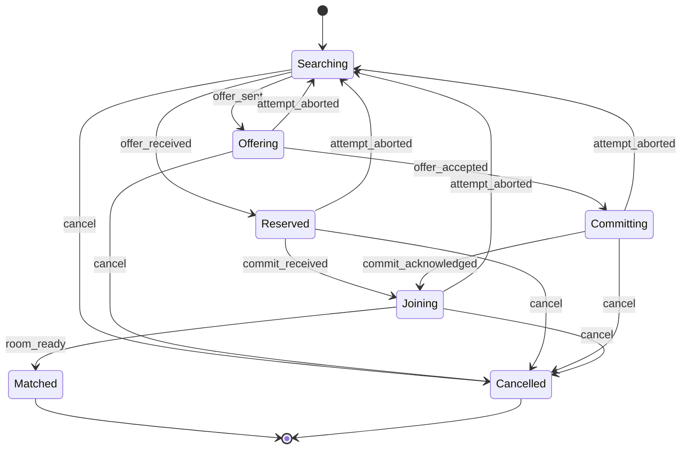

# Matchmaking

```mermaid
stateDiagram-v2
    [*] --> Searching
    Matched --> [*]
    Cancelled --> [*]
    Searching --> Offering : offer_sent
    Searching --> Reserved : offer_received
    Offering --> Committing : offer_accepted
    Reserved --> Joining : commit_received
    Committing --> Joining : commit_acknowledged
    Offering --> Searching : attempt_aborted
    Reserved --> Searching : attempt_aborted
    Committing --> Searching : attempt_aborted
    Joining --> Searching : attempt_aborted
    Joining --> Matched : room_ready
    Searching --> Cancelled : cancel
    Offering --> Cancelled : cancel
    Reserved --> Cancelled : cancel
    Committing --> Cancelled : cancel
    Joining --> Cancelled : cancel
```
