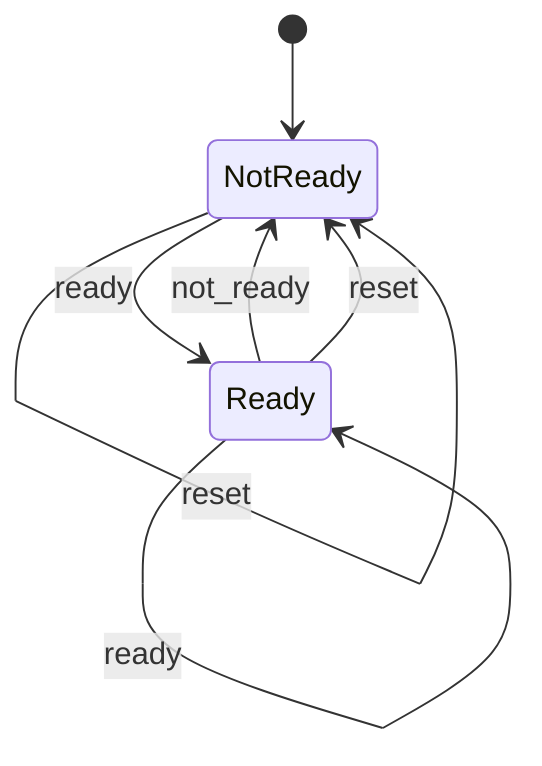

# Player readiness

```mermaid
stateDiagram-v2
    [*] --> NotReady
    NotReady --> Ready : ready
    Ready --> Ready : ready
    Ready --> NotReady : not_ready
    NotReady --> NotReady : not_ready
    Ready --> NotReady : reset
    NotReady --> NotReady : reset
```
