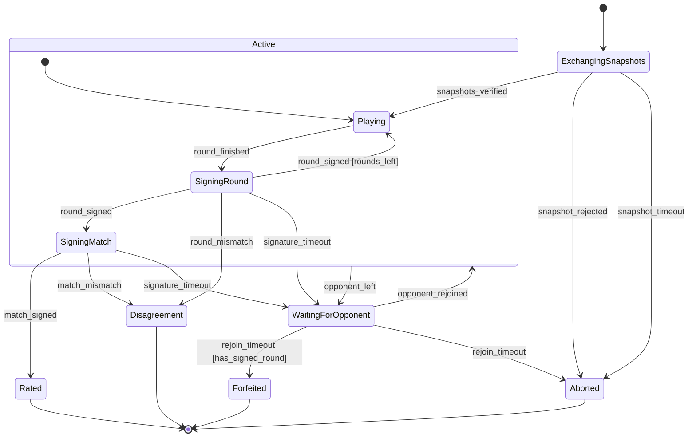

# Rating match

```mermaid
stateDiagram-v2
    [*] --> ExchangingSnapshots
    Rated --> [*]
    Forfeited --> [*]
    Disagreement --> [*]
    Aborted --> [*]
    ExchangingSnapshots --> Playing : snapshots_verified
    ExchangingSnapshots --> Aborted : snapshot_rejected
    ExchangingSnapshots --> Aborted : snapshot_timeout
    Playing --> SigningRound : round_finished
    SigningRound --> Playing : round_signed [rounds_left]
    SigningRound --> SigningMatch : round_signed
    SigningRound --> Disagreement : round_mismatch
    SigningMatch --> Rated : match_signed
    SigningMatch --> Disagreement : match_mismatch
    Active --> WaitingForOpponent : opponent_left
    SigningRound --> WaitingForOpponent : signature_timeout
    SigningMatch --> WaitingForOpponent : signature_timeout
    WaitingForOpponent --> Active : opponent_rejoined
    WaitingForOpponent --> Forfeited : rejoin_timeout [has_signed_round]
    WaitingForOpponent --> Aborted : rejoin_timeout

    state Active {
        [*] --> Playing
        Playing
        SigningRound
        SigningMatch
    }
```
