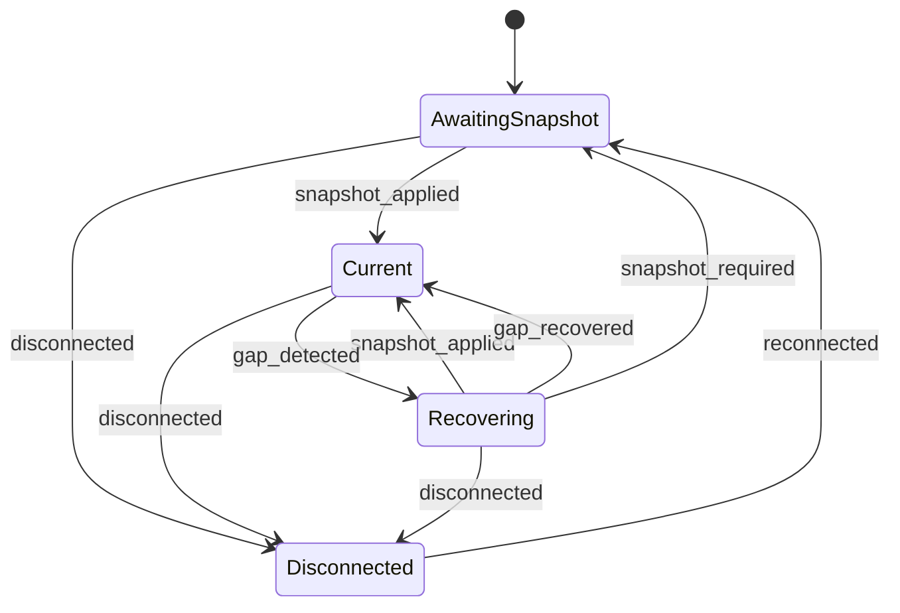

# State synchronization

```mermaid
stateDiagram-v2
    [*] --> AwaitingSnapshot
    AwaitingSnapshot --> Current : snapshot_applied
    Recovering --> Current : snapshot_applied
    Current --> Recovering : gap_detected
    Recovering --> Current : gap_recovered
    Recovering --> AwaitingSnapshot : snapshot_required
    AwaitingSnapshot --> Disconnected : disconnected
    Current --> Disconnected : disconnected
    Recovering --> Disconnected : disconnected
    Disconnected --> AwaitingSnapshot : reconnected
```
