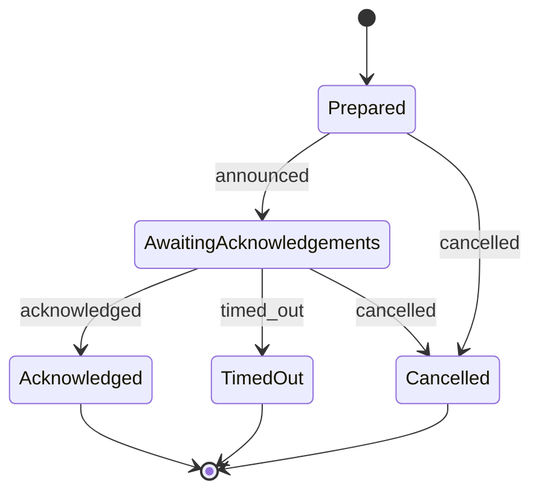

# Synchronized start

```mermaid
stateDiagram-v2
    [*] --> Prepared
    Acknowledged --> [*]
    TimedOut --> [*]
    Cancelled --> [*]
    Prepared --> AwaitingAcknowledgements : announced
    AwaitingAcknowledgements --> Acknowledged : acknowledged
    AwaitingAcknowledgements --> TimedOut : timed_out
    Prepared --> Cancelled : cancelled
    AwaitingAcknowledgements --> Cancelled : cancelled
```
