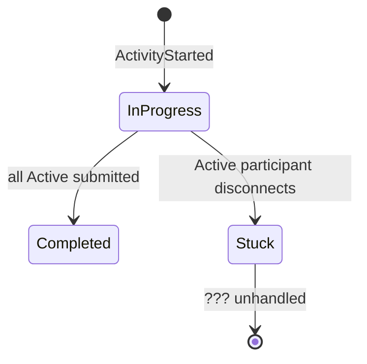

# Problem: Activity Blocks on Disconnect

## Current Rule

Activity completes when **all Active participants** submit a result.

## The Gap

If an Active participant disconnects mid-activity, the activity **never completes**. No ADR or domain doc addresses this.

## Scenarios

## Proposed Rules

| Event | Action |
|-------|--------|
| Active participant disconnects during activity | Remove from required submissions |
| All remaining Active have submitted | Activity completes normally |
| All Active participants disconnect | Host cancels activity |

## Mode Change During Activity

Current rule: ParticipationMode cannot change while InProgress.

Clarification needed: does **disconnect** count as switching to Spectating or as removal?

Recommendation: **removal** — cleaner, no ghost participants blocking completion.

## See Also

- [[../domain/activity|Activity]] — state machine
- [[../concepts/participation-modes|Participation Modes]]
- [[../concepts/host-delegation|Host Delegation]] — disconnect detection already exists
