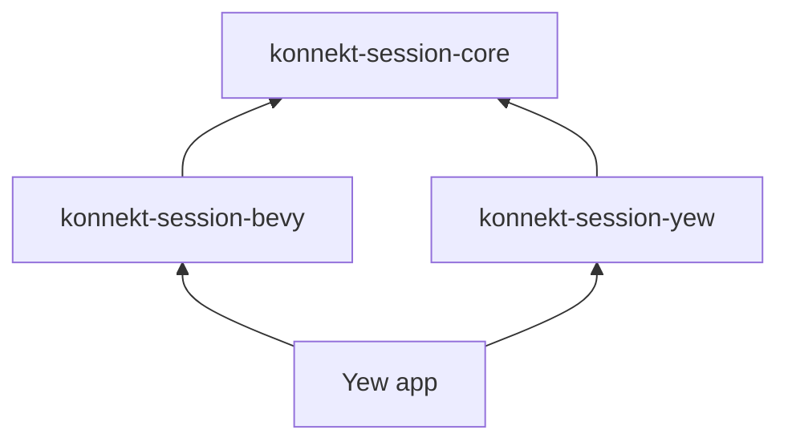

# Gap: Bevy ECS Layer Missing

## Intent

User wants Bevy ECS as the application layer — headless, no rendering. Yew reads from and writes to the Bevy world. Mini-games are Yew components.

No ADR or architecture doc reflects this.

## Proposed: konnekt-session-bevy

A new crate wrapping the domain in Bevy ECS primitives.

## Bevy Crate Responsibilities

| Bevy Primitive | Maps To |
|----------------|---------|
| `Resource` | `LobbyState`, `GameSessionState` |
| `Event` | Domain events — `PlayerJoined`, `ActivityStarted` |
| `Plugin` | `LobbyPlugin`, `NetworkPlugin` |
| `System` | Command handlers, event broadcast |

## Bevy Headless in WASM

- Use `MinimalPlugins` — no rendering, no window
- Tick via `App::update()` called from Yew's `use_animation_frame`
- Yew holds `Rc<RefCell<App>>` in context

## Mini-Game Contract

Each mini-game can optionally provide a Bevy plugin for its logic. The Yew component is always required. The Bevy plugin is optional.

## Future Path

Adding a Bevy UI lobby later requires only swapping `MinimalPlugins` for `DefaultPlugins` and adding a render plugin. The ECS state is unchanged.

## See Also

- [[../architecture/overview|Architecture Overview]]
- [[scope-creep|Scope Creep — simplify what stays in workspace]]
