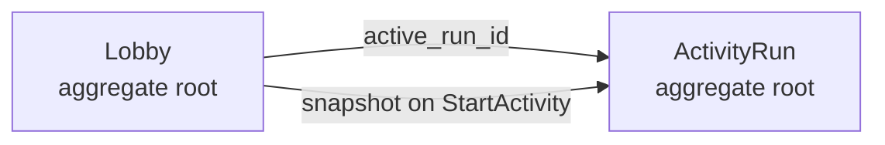
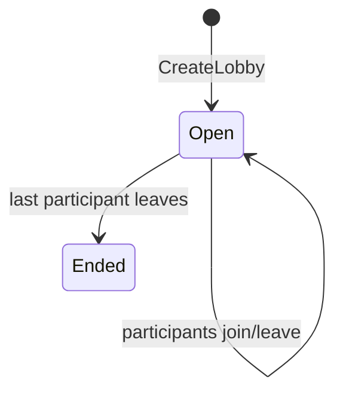
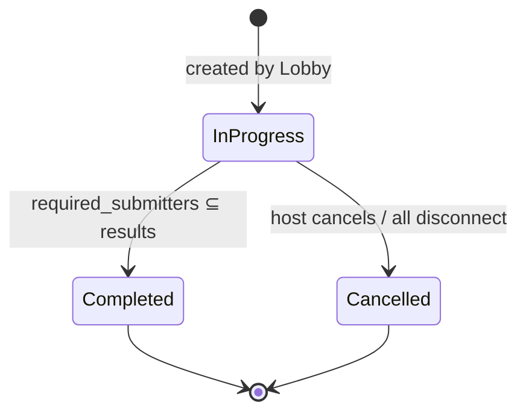
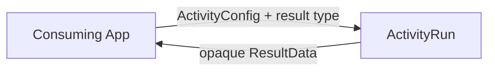
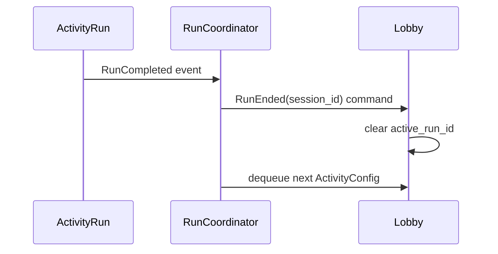
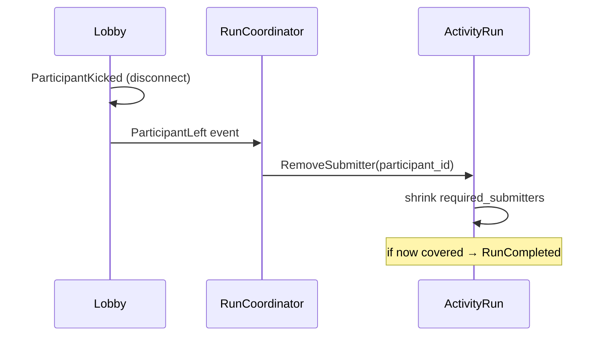

# Rethink: Domain Aggregates

## Two Aggregates

Communicate by ID only. `ActivityRun` holds `LobbyId` — never a `Lobby` reference.

---

## Lobby

**The room.** Manages membership and session lifecycle.

### Fields

| Field | Type | Notes |
|-------|------|-------|
| `id` | `LobbyId` | — |
| `participants` | `Map<ParticipantId, Participant>` | map — uniqueness + O(1) |
| `activity_queue` | `Queue<ActivityConfig>` | ordered value objects |
| `active_run_id` | `Option<ActivityRunId>` | None when idle |

### Lifecycle

No explicit close command needed — Lobby ends when empty.

### Invariants

- Exactly one `Host` at all times
- `active_run_id` is `Some` only while a session is `InProgress`
- Only Host may mutate Lobby state

### Commands & Events

| Command | Event |
|---------|-------|
| `JoinLobby` | `ParticipantJoined` |
| `KickGuest` | `ParticipantKicked` |
| `DelegateHost` | `HostDelegated` |
| `SetParticipationMode` | `ParticipationModeChanged` |
| `QueueActivity` | `ActivityQueued` |
| `StartNextActivity` | → creates ActivityRun |
| `RunEnded(id)` | `active_run_id` cleared |

---

## ActivityRun

**One game in progress.** Created from a snapshot of Active participants.

### Fields

| Field | Type | Notes |
|-------|------|-------|
| `id` | `ActivityRunId` | — |
| `lobby_id` | `LobbyId` | reference only |
| `config` | `ActivityConfig` | what game is being played |
| `required_submitters` | `Set<ParticipantId>` | snapshot at creation |
| `results` | `Map<ParticipantId, ResultData>` | opaque — consuming app owns type |
| `status` | `RunStatus` | `InProgress \| Completed \| Cancelled` |

### Lifecycle

### Invariants

- `required_submitters` only shrinks — never grows after creation
- A participant may only submit once
- Completes when `results.keys()` covers all of `required_submitters`

### Commands & Events

| Command | Event |
|---------|-------|
| `SubmitResult(id, data)` | `ResultSubmitted` |
| `RemoveSubmitter(id)` | `SubmitterRemoved` → may trigger completion |
| `CancelSession` | `ActivityCancelled` |

---

## Result Data — Opaque by Design

The library does not know the result type. `ResultData` is opaque bytes or `serde_json::Value`. The consuming app owns the type and deserializes after the session completes.

This keeps the library generic without Rust generics on the aggregate.

---

## Cross-Aggregate Coordination

Aggregates do not call each other. A domain service or Bevy system mediates.

In Bevy: `RunCoordinator` is a system reading `EventReader<RunCompleted>` and writing commands to both aggregates.

---

## Disconnect Handling

---

## ParticipantId = Public Key

`ParticipantId` is derived from the Ed25519 public key (ADR-0004). Deterministic — same credentials → same identity across reconnections.

---

## See Also

- [[../domain/lobby|Lobby]] — update fields
- [[../domain/activity|Activity]] — split into ActivityConfig + ActivityRun
- [[../rethink/activity-disconnect|Activity Disconnect]]
- [[../adr/0024|ADR-0024]] — Bevy systems handle coordination
