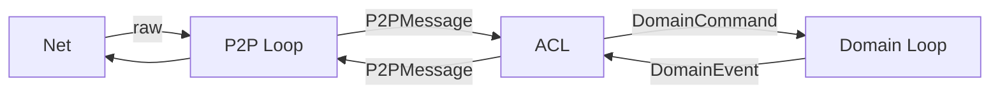
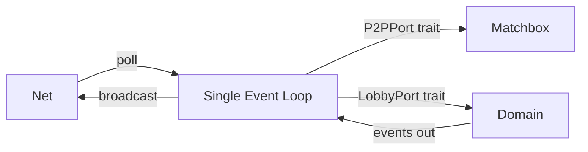

# Problem: Dual Event Loop Too Complex

## Current Design

Two loops separated by an Anti-Corruption Layer (ACL) via mpsc channels.

## Why It Hurts

- Two async loops → deadlocks, starvation ([[../adr/0022|ADR-0022]] exists *because* of this)
- ACL translation code = extra surface area
- Channel backpressure must be managed
- Hard to test: timing-sensitive, ordering issues

## Proposed Replacement

**Single loop. Port traits isolate infrastructure.**

- Domain stays pure — receives commands, emits events
- P2P transport hidden behind `P2PPort` trait
- Single `tokio::select!` or browser event loop tick
- No channels between loops — direct trait calls

## Trade-offs

| | Dual Loop | Single Loop |
|-|-----------|-------------|
| Complexity | High | Medium |
| Deadlock risk | Real | Minimal |
| Swap transport | Clean | Clean (same ports) |
| Debuggability | Needs tokio-console | Standard tracing |

Transport swappability is preserved via the port trait — no regression on the original goal of [[../adr/0020|ADR-0020]].

## See Also

- [[../adr/0020|ADR-0020]] — original decision
- [[../adr/0022|ADR-0022]] — tokio-console only needed because of this
- [[../adr/0021|ADR-0021]] — Mockall still useful for port traits
