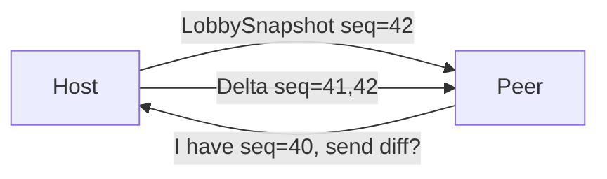

# Problem: Event Sourcing Too Complex

## Why It Was Added

Full audit trail, peer replay after reconnect, consistent state reconstruction.

## Why It Hurts

- Event versioning required — breaking changes are painful
- Snapshot strategy adds infrastructure
- Reconnection replay must handle gaps, duplicates, ordering
- `LocalStorage` event cache ([[../adr/0015|ADR-0015]]) adds another layer to maintain

## Actual Need

Lobby state is small. Max ~20 participants, ~10 queued activities ≈ **2–3 KB total**.

## Proposed Replacement

**State snapshot + sequence number.**

- Reconnecting peer requests latest snapshot from host
- Host broadcasts full snapshot on any state change
- Sequence number detects reordering — discard stale
- No replay, no event log, no snapshot strategy

## Trade-offs

| | Event Sourcing | Snapshot |
|-|----------------|----------|
| Complexity | High | Low |
| Reconnection | Replay log | Request snapshot |
| Audit trail | Full | None |
| State size sensitivity | Low | Low (2–3 KB) |

Audit trail is not a lobby requirement.

## See Also

- [[../adr/0010|ADR-0010]] — original decision
- [[../adr/0015|ADR-0015]] — event cache (can be removed)
- [[dual-loop-too-complex|Dual Loop — also simplifiable]]
