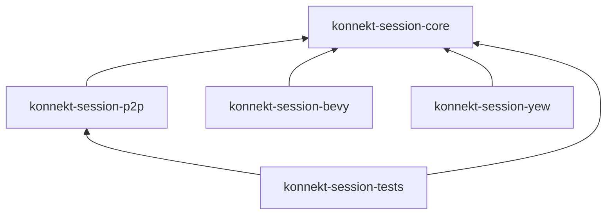

# Rethink

Critical review of current design. Goal: reduce complexity, align with actual use case.

## Problems Found

- [[event-sourcing-too-complex|Event Sourcing]] — overkill for a lobby
- [[dual-loop-too-complex|Dual Event Loop + ACL]] — over-engineered, hard to debug
- [[scope-creep|Scope Creep]] — TUI, CLI, schemas not library concerns
- [[activity-disconnect|Activity Disconnect]] — unhandled blocking scenario
- [[bevy-missing|Bevy ECS layer missing]] — user intent not reflected in architecture

## Proposed Changes

| What | Action |
|------|--------|
| Event Sourcing | Replace with state snapshot + sequence number |
| Dual Event Loop | Collapse to single loop with port traits |
| Ratatui/Clap/arboard | Move to separate dev binary |
| schemars/aide | Remove — premature |
| MessagePack feature | Remove — 35% saving irrelevant at 1–10 msg/s |
| Bevy crate | Add `konnekt-session-bevy` |

## Revised Crate Structure

## See Also

- [[../architecture/overview|Architecture Overview]]
- [[../adr/index|ADR Index]]
