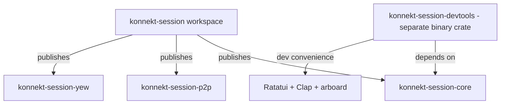

# Problem: Scope Creep

The library workspace contains dev tooling that is not a library concern.

## What Does Not Belong

| Crate / Feature | ADR | Reason Out |
|-----------------|-----|------------|
| Ratatui TUI | [[../adr/0018|0018]] | Dev convenience, not library API |
| Clap CLI | [[../adr/0016|0016]] | Dev convenience, not library API |
| arboard clipboard | [[../adr/0019|0019]] | TUI helper |
| schemars / aide | [[../adr/0017|0017]] | No known consumer yet |
| MessagePack feature | [[../adr/0009|0009]] | Premature at 1–10 msg/s |
| tokio-console feature | [[../adr/0022|0022]] | Dev-only, needed only because of dual loop |
| tracing-chrome feature | [[../adr/0023|0023]] | Dev-only profiling |

## Proposed Split

## What Stays

- `tracing` — stays, it is the production logging API
- `thiserror` — stays, domain errors
- `garde` — stays, validation
- `instant` — stays, WASM time

## Benefit

Library workspace compiles faster. Published crates have fewer transitive dependencies. Dev tooling evolves independently.
